# 📚 HTTP Methods and CRUD Operations

> **Complete Guide to RESTful CRUD Operations in ASP.NET Core Web API**

---

## 🎯 HTTP Methods Overview

HTTP methods (also called HTTP verbs) define the action to perform on a resource:

```mermaid
graph LR
    subgraph "HTTP Methods → Database Operations"
        GET["GET<br>📖 SELECT"]
        POST["POST<br>➕ INSERT"]
        PUT["PUT<br>✏️ UPDATE"]
        DELETE["DELETE<br>🗑️ DELETE"]
        PATCH["PATCH<br>📝 PARTIAL UPDATE"]
    end
```



### Method Characteristics

| Method | Purpose | Has Body | Idempotent | Safe | Cacheable |
|--------|---------|----------|------------|------|-----------|
| **GET** | Read data | ❌ No | ✅ Yes | ✅ Yes | ✅ Yes |
| **POST** | Create data | ✅ Yes | ❌ No | ❌ No | ❌ No |
| **PUT** | Replace data | ✅ Yes | ✅ Yes | ❌ No | ❌ No |
| **PATCH** | Partial update | ✅ Yes | ✅ Yes | ❌ No | ❌ No |
| **DELETE** | Remove data | ❌ No | ✅ Yes | ❌ No | ❌ No |

> **Idempotent**: Multiple identical requests produce the same result  
> **Safe**: Doesn't modify data  
> **Cacheable**: Response can be cached

---

## 📖 GET - Read Operations

### GET All Resources

```csharp
// ════════════════════════════════════════════════════════════════════
// GET ALL MEMBERS
// URL: GET /api/member
// ════════════════════════════════════════════════════════════════════
[HttpGet]
// Line 1: Maps to HTTP GET method at base route /api/member
//         - No route template = base route only
public IEnumerable<Members> Get()
// Line 2: Returns collection of Members
//         - IEnumerable<T> = Serializes to JSON array
//         - Sync method (no async)
{
    return member.GetAllMember();
    // Line 3: Call repository to get all members
}
```

**Request:**
```http
GET /api/member HTTP/1.1
Host: localhost:5000
Accept: application/json
```

**Response:**
```json
HTTP/1.1 200 OK
Content-Type: application/json

[
  { "memberId": 1, "firstName": "Kirtesh", "lastName": "Trivedi", "address": "Mumbai" },
  { "memberId": 2, "firstName": "Nitya", "lastName": "Shah", "address": "Vadodara" }
]
```

---

### GET Single Resource by ID

```csharp
// ════════════════════════════════════════════════════════════════════
// GET MEMBER BY ID
// URL: GET /api/member/5
// ════════════════════════════════════════════════════════════════════
[HttpGet("{id:int}")]
// Line 1: Route parameter with integer constraint
//         - {id} = Captures URL segment
//         - :int = Only matches integer values
//         - Prevents /api/member/abc from matching
public Members Get(int id)
// Line 2: Parameter name MUST match route parameter name
//         - Automatic binding from URL to parameter
{
    return member.GetMember(id);
    // Line 3: Find and return single member
}
```

**Request:**
```http
GET /api/member/5 HTTP/1.1
Host: localhost:5000
```

**Response:**
```json
HTTP/1.1 200 OK
Content-Type: application/json

{
  "memberId": 5,
  "firstName": "Swati",
  "lastName": "Zaveri",
  "address": "Mumbai"
}
```

---

### GET with Query Parameters (Filtering)

```csharp
// ════════════════════════════════════════════════════════════════════
// GET MEMBERS BY NAME
// URL: GET /api/member/Kirtesh
// ════════════════════════════════════════════════════════════════════
[HttpGet("{name}")]
// Line 1: String route parameter (no constraint)
//         - Less specific than {id:int}
//         - Route precedence: {id:int} matches first for integers
public IEnumerable<Members> Get(string name)
// Line 2: Returns filtered collection
{
    return member.GetAllMemberbyname(name);
    // Line 3: Filter members by first name
}

// ════════════════════════════════════════════════════════════════════
// GET MEMBERS BY ADDRESS
// URL: GET /api/member/Address/Mumbai
// ════════════════════════════════════════════════════════════════════
[HttpGet("Address/{address}")]
// Line 1: Literal segment + parameter
//         - "Address" = Fixed URL segment
//         - {address} = Variable parameter
public IEnumerable<Members> GetAddress(string address)
// Line 2: Method name different from parameter (OK)
{
    return member.GetAllMemberbyaddress(address);
    // Line 3: Filter by address
}
```

---

## ➕ POST - Create Operations

```csharp
// ════════════════════════════════════════════════════════════════════
// CREATE NEW MEMBER
// URL: POST /api/member
// ════════════════════════════════════════════════════════════════════
[HttpPost]
// Line 1: Maps to HTTP POST method
//         - Used for creating new resources
//         - Request body contains new resource data
public Members Post([FromBody] Members memberpost)
// Line 2: [FromBody] = Bind JSON body to object
//         - With [ApiController], [FromBody] is inferred for complex types
//         - JSON deserialized to Members object
//         - Model validation runs automatically
{
    return member.Add(memberpost);
    // Line 3: Add to collection and return created member
    //         - Typically includes generated ID
}
```

**Request:**
```http
POST /api/member HTTP/1.1
Host: localhost:5000
Content-Type: application/json

{
  "firstName": "John",
  "lastName": "Doe",
  "address": "Delhi"
}
```

**Response:**
```json
HTTP/1.1 200 OK
Content-Type: application/json

{
  "memberId": 7,
  "firstName": "John",
  "lastName": "Doe",
  "address": "Delhi"
}
```

---

### POST with CreatedAtAction (Best Practice)

```csharp
// ════════════════════════════════════════════════════════════════════
// CREATE EMPLOYEE WITH PROPER HTTP 201 RESPONSE
// URL: POST /api/employee
// ════════════════════════════════════════════════════════════════════
[HttpPost]
// Line 1: HTTP POST for creation
public ActionResult Post([FromBody] Employee emp)
// Line 2: Returns ActionResult for status code control
{
    employeeService.Add(emp);
    // Line 3: Add employee to database
    
    return CreatedAtAction("Get", new { id = emp.Id }, emp);
    // Line 4: CreatedAtAction returns HTTP 201 Created
    //         - "Get" = Name of action to get this resource
    //         - new { id = emp.Id } = Route values for Location header
    //         - emp = Response body (created resource)
    //
    // Response Headers:
    // HTTP/1.1 201 Created
    // Location: /api/employee/7
}
```

**Response:**
```http
HTTP/1.1 201 Created
Location: /api/employee/7
Content-Type: application/json

{
  "id": 7,
  "name": "John Doe",
  "email": "john@example.com",
  "departmentId": 1
}
```

---

## ✏️ PUT - Update Operations (Full Replace)

```csharp
// ════════════════════════════════════════════════════════════════════
// UPDATE MEMBER (FULL REPLACE)
// URL: PUT /api/member/5
// ════════════════════════════════════════════════════════════════════
[HttpPut("{id}")]
// Line 1: HTTP PUT with ID parameter
//         - PUT = Full replacement of resource
//         - All fields must be provided
public Members Put(int id, [FromBody] Members memberput)
// Line 2: Both route param (id) and body (memberput) are bound
//         - id: From URL segment
//         - memberput: From request body JSON
{
    return member.Update(id, memberput);
    // Line 3: Update and return modified member
}
```

### Repository Implementation

```csharp
public Members Update(int id, Members memberChanges)
{
    Members member = lisMembers.FirstOrDefault(e => e.MemberId == memberChanges.MemberId);
    // Line 1: Find existing member by ID
    //         - FirstOrDefault returns null if not found
    
    if (member != null)
    // Line 2: Only update if member exists
    {
        member.FirstName = memberChanges.FirstName;
        // Line 3: Replace first name
        member.LastName = memberChanges.LastName;
        // Line 4: Replace last name
        member.Address = memberChanges.Address;
        // Line 5: Replace address
        // All fields are replaced - that's PUT semantics
    }
    return member;
    // Line 6: Return updated member
}
```

**Request:**
```http
PUT /api/member/5 HTTP/1.1
Host: localhost:5000
Content-Type: application/json

{
  "memberId": 5,
  "firstName": "Swati",
  "lastName": "Patel",
  "address": "Pune"
}
```

---

### PUT with Entity Framework

```csharp
// ════════════════════════════════════════════════════════════════════
// UPDATE EMPLOYEE WITH EF CORE
// ════════════════════════════════════════════════════════════════════
public Employee Update(Employee employeeChanges)
{
    Employee e1 = context.Employee.FirstOrDefault(m => m.Id == employeeChanges.Id);
    // Line 1: Get tracked entity from database
    
    context.Entry(e1).State = EntityState.Detached;
    // Line 2: Detach original entity to avoid tracking conflict
    //         - EF Core tracks entities by primary key
    //         - Can't have two tracked entities with same key
    
    context.Update(employeeChanges);
    // Line 3: Attach new entity and mark as modified
    //         - All properties will be updated
    
    context.SaveChanges();
    // Line 4: Execute UPDATE SQL statement
    
    return employeeChanges;
    // Line 5: Return updated entity
}
```

---

## 🗑️ DELETE - Remove Operations

```csharp
// ════════════════════════════════════════════════════════════════════
// DELETE MEMBER
// URL: DELETE /api/member/5
// ════════════════════════════════════════════════════════════════════
[HttpDelete("{id}")]
// Line 1: HTTP DELETE with ID parameter
//         - DELETE = Remove resource
public void Delete(int id)
// Line 2: void return = HTTP 204 No Content response
//         - Standard for successful DELETE
//         - No response body needed
{
    member.Delete(id);
    // Line 3: Remove member from collection
}
```

### Repository Implementation

```csharp
public Members Delete(int Id)
{
    Members members = lisMembers.FirstOrDefault(e => e.MemberId == Id);
    // Line 1: Find member to delete
    
    if (members != null)
    // Line 2: Only delete if exists
    {
        lisMembers.Remove(members);
        // Line 3: Remove from in-memory list
    }
    return members;
    // Line 4: Return deleted member (or null)
}
```

### DELETE with Entity Framework

```csharp
// ════════════════════════════════════════════════════════════════════
// DELETE WITH EF CORE
// ════════════════════════════════════════════════════════════════════
public Employee? Delete(int Id)
{
    Employee? employee = context.Employee.Find(Id);
    // Line 1: Find by primary key
    //         - Find() returns null if not found
    
    if (employee != null)
    // Line 2: Only delete if exists
    {
        context.Employee.Remove(employee);
        // Line 3: Mark entity for deletion
        //         - Sets EntityState to Deleted
        
        context.SaveChanges();
        // Line 4: Execute DELETE SQL statement
    }
    return employee;
    // Line 5: Return deleted entity (for logging/response)
}
```

---

## 🔄 Async CRUD Operations

### Complete Async Controller

```csharp
// ════════════════════════════════════════════════════════════════════
// ASYNC BOOK CONTROLLER
// Complete async CRUD implementation
// ════════════════════════════════════════════════════════════════════
[ApiController]
[Route("api/[controller]")]
public class BookController : ControllerBase
{
    private readonly IBookRepository _bookRepository;

    public BookController(IBookRepository bookRepository)
    {
        _bookRepository = bookRepository;
    }

    // ══════════════════════════════════════════════════════════════
    // ASYNC GET ALL
    // ══════════════════════════════════════════════════════════════
    [HttpGet]
    public async Task<ActionResult<IEnumerable<Book>>> GetAllBooks()
    // Line 1: async = Method can await
    //         Task<T> = Async return wrapper
    //         ActionResult<T> = Both data and status codes
    {
        var books = await _bookRepository.GetAllAsync();
        // Line 2: await = Non-blocking wait for async operation
        //         Thread returns to pool while waiting for DB
        
        return Ok(books);
        // Line 3: 200 OK with book list
    }

    // ══════════════════════════════════════════════════════════════
    // ASYNC GET BY ID
    // ══════════════════════════════════════════════════════════════
    [HttpGet("{id}")]
    public async Task<ActionResult<Book>> GetBookById(int id)
    {
        var book = await _bookRepository.GetByIdAsync(id);
        // Line 1: Async database lookup
        
        if (book == null)
            return NotFound();
        // Line 2: 404 Not Found if no book

        return Ok(book);
        // Line 3: 200 OK with book data
    }

    // ══════════════════════════════════════════════════════════════
    // ASYNC POST (CREATE)
    // ══════════════════════════════════════════════════════════════
    [HttpPost]
    public async Task<ActionResult<Book>> AddBook(Book book)
    {
        var createdBook = await _bookRepository.AddAsync(book);
        // Line 1: Async add to database
        
        return CreatedAtAction(nameof(GetBookById), new { id = createdBook.BookId }, createdBook);
        // Line 2: 201 Created with Location header
        //         nameof() = Compiler-safe method name
    }

    // ══════════════════════════════════════════════════════════════
    // ASYNC PUT (UPDATE)
    // ══════════════════════════════════════════════════════════════
    [HttpPut("{id}")]
    public async Task<ActionResult<Book>> UpdateBook(int id, Book book)
    {
        var updatedBook = await _bookRepository.UpdateAsync(id, book);
        // Line 1: Async update in database
        
        if (updatedBook == null)
            return NotFound();
        // Line 2: 404 if book doesn't exist

        return Ok(updatedBook);
        // Line 3: 200 OK with updated book
    }

    // ══════════════════════════════════════════════════════════════
    // ASYNC DELETE
    // ══════════════════════════════════════════════════════════════
    [HttpDelete("{id}")]
    public async Task<ActionResult<Book>> DeleteBook(int id)
    {
        var deletedBook = await _bookRepository.DeleteAsync(id);
        // Line 1: Async delete from database
        
        if (deletedBook == null)
            return NotFound();
        // Line 2: 404 if book doesn't exist

        return Ok(deletedBook);
        // Line 3: 200 OK with deleted book info
    }
}
```

---

## 📊 CRUD Flow Diagram


---

## 📋 Quick Revision Points

| HTTP Method | CRUD | SQL | Response Code | Has Body |
|-------------|------|-----|---------------|----------|
| GET | Read | SELECT | 200 OK | ❌ Request / ✅ Response |
| POST | Create | INSERT | 201 Created | ✅ Both |
| PUT | Update | UPDATE | 200 OK | ✅ Both |
| DELETE | Delete | DELETE | 200/204 | ❌ Request / Optional Response |

---

## 🎯 Key Takeaways

1. **GET** = Read-only, cacheable, idempotent
2. **POST** = Create new, not idempotent (creates each time)
3. **PUT** = Full replacement, idempotent
4. **DELETE** = Remove resource, idempotent
5. **201 Created** = Use for successful POST
6. **204 No Content** = Use for successful DELETE
7. **async/await** = Non-blocking I/O for scalability

---

## 📚 Interview Questions

**Q1: What is the difference between PUT and PATCH?**
> PUT replaces the entire resource (all fields required). PATCH updates only specified fields (partial update).

**Q2: Why is POST not idempotent?**
> Each POST creates a new resource with a new ID. Calling POST twice creates two resources, unlike PUT which updates the same resource.

**Q3: What status code should POST return?**
> 201 Created with a Location header pointing to the new resource, and the created resource in the body.

**Q4: When should you use async/await in controllers?**
> Always for I/O-bound operations (database, HTTP calls, file access). Improves scalability by freeing threads during wait.

---

*Next: [06_Action_Return_Types.md](06_Action_Return_Types.md) - IActionResult, ActionResult<T>, and Status Codes*
