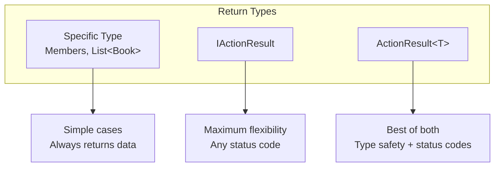
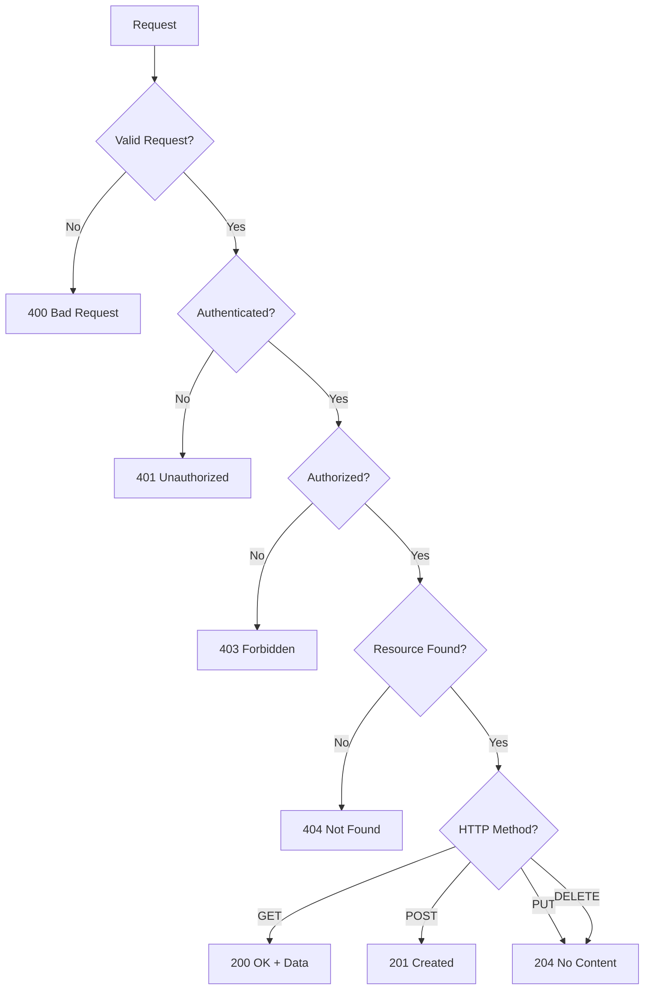

# 📚 Action Return Types in ASP.NET Core Web API

> **Complete Guide to IActionResult, ActionResult<T>, and HTTP Status Codes**

---

## 🎯 Overview

Controller actions can return different types, each with specific use cases:



---

## 📦 Return Type Options

### 1. Specific Type (Direct Return)

```csharp
// ════════════════════════════════════════════════════════════════════
// DIRECT TYPE RETURN
// Returns 200 OK with data (or 204 No Content if null)
// ════════════════════════════════════════════════════════════════════
[HttpGet]
public IEnumerable<Members> Get()
// Line 1: Returns collection directly
//         - 200 OK with JSON array
//         - Simple and clean for success cases
{
    return member.GetAllMember();
}

[HttpGet("{id:int}")]
public Members Get(int id)
// Line 1: Returns single object directly
//         - 200 OK with JSON object
//         - Returns null → 204 No Content
{
    return member.GetMember(id);
}
```

**Pros:** Simple, clean, type-safe  
**Cons:** Limited status code control

---

### 2. IActionResult (Maximum Flexibility)

```csharp
// ════════════════════════════════════════════════════════════════════
// IACTIONRESULT
// Full control over HTTP response
// ════════════════════════════════════════════════════════════════════
[HttpGet("{id}")]
public IActionResult GetById(int id)
// Line 1: IActionResult = Any action result
//         - Full status code control
//         - No compile-time type checking
{
    var employee = employeeService.GetEmployee(id);
    
    if (employee == null)
        return NotFound();
    // Line 2: 404 Not Found
    
    return Ok(employee);
    // Line 3: 200 OK with data
}

[HttpPost]
public IActionResult Create([FromBody] Employee emp)
{
    if (!ModelState.IsValid)
        return BadRequest(ModelState);
    // Line 1: 400 Bad Request with validation errors
    
    employeeService.Add(emp);
    
    return CreatedAtAction("GetById", new { id = emp.Id }, emp);
    // Line 2: 201 Created with Location header
}
```

---

### 3. ActionResult<T> (Recommended)

```csharp
// ════════════════════════════════════════════════════════════════════
// ACTIONRESULT<T> - Best Practice
// Type safety + status code control
// ════════════════════════════════════════════════════════════════════
[HttpGet("{id}")]
public ActionResult<Book> GetBookById(int id)
// Line 1: ActionResult<T> combines:
//         - Type safety (Swagger knows return type)
//         - Status code control (can return NotFound, etc.)
{
    var book = _bookRepository.GetByIdAsync(id);
    
    if (book == null)
        return NotFound();
    // Line 2: Returns 404 - allowed by ActionResult
    
    return book;
    // Line 3: Implicit conversion to ActionResult<Book>
    //         Returns 200 OK with book JSON
}

[HttpPost]
public ActionResult<Book> AddBook(Book book)
{
    var createdBook = _bookRepository.AddAsync(book);
    
    return CreatedAtAction(nameof(GetBookById), new { id = createdBook.BookId }, createdBook);
    // Line 1: 201 Created
    //         - nameof() = Compile-time safe method name
    //         - Location header = /api/book/7
    //         - Body = created book
}
```

---

## 📊 Status Code Methods

### Success Responses (2xx)

```csharp
// ════════════════════════════════════════════════════════════════════
// SUCCESS RESPONSES
// ════════════════════════════════════════════════════════════════════

return Ok();
// Line: 200 OK (no body)

return Ok(data);
// Line: 200 OK with data in body

return Created("/api/items/5", item);
// Line: 201 Created with Location header and body

return CreatedAtAction("Get", new { id = item.Id }, item);
// Line: 201 Created with route-based Location

return CreatedAtRoute("GetItem", new { id = item.Id }, item);
// Line: 201 Created using named route

return NoContent();
// Line: 204 No Content (typical for PUT/DELETE success)

return Accepted();
// Line: 202 Accepted (for async processing)
```

### Client Error Responses (4xx)

```csharp
// ════════════════════════════════════════════════════════════════════
// CLIENT ERROR RESPONSES
// ════════════════════════════════════════════════════════════════════

return BadRequest();
// Line: 400 Bad Request (no details)

return BadRequest("Custom error message");
// Line: 400 with string message

return BadRequest(ModelState);
// Line: 400 with validation errors

return Unauthorized();
// Line: 401 Unauthorized (not authenticated)

return Forbid();
// Line: 403 Forbidden (authenticated but not authorized)

return NotFound();
// Line: 404 Not Found (no details)

return NotFound($"Item with ID {id} not found");
// Line: 404 with custom message

return Conflict();
// Line: 409 Conflict (e.g., duplicate key)

return UnprocessableEntity(ModelState);
// Line: 422 Unprocessable Entity (validation failed)
```

### Server Error Responses (5xx)

```csharp
// ════════════════════════════════════════════════════════════════════
// SERVER ERROR RESPONSES
// ════════════════════════════════════════════════════════════════════

return StatusCode(500);
// Line: 500 Internal Server Error

return StatusCode(500, "Something went wrong");
// Line: 500 with message

return Problem("Error details", statusCode: 500);
// Line: 500 with Problem Details format (RFC 7807)
```

---

## 🔧 Complete Controller Example

```csharp
// ════════════════════════════════════════════════════════════════════
// EMPLOYEE CONTROLLER WITH PROPER STATUS CODES
// ════════════════════════════════════════════════════════════════════
[Route("api/[controller]")]
[ApiController]
public class EmployeeController : ControllerBase
{
    IEmployeeService employeeService;
    
    public EmployeeController(IEmployeeService employeeService)
    {
        this.employeeService = employeeService;
    }

    // GET: api/employee
    // Returns: 200 OK with array
    [HttpGet]
    public IEnumerable<Employee> Get()
    {
        return employeeService.GetAllEmployee();
    }

    // GET: api/employee/5
    // Returns: 200 OK or 404 Not Found
    [HttpGet("{id}")]
    public Employee Get(int id)
    {
        return employeeService.GetEmployee(id);
    }

    // POST: api/employee
    // Returns: 201 Created with Location header
    [HttpPost]
    public ActionResult Post([FromBody] Employee emp)
    {
        employeeService.Add(emp);
        return CreatedAtAction("Get", new { id = emp.Id }, emp);
        // Line 1: "Get" = Action to retrieve this resource
        // Line 2: new { id = emp.Id } = Route values
        // Line 3: emp = Response body
        //
        // Response:
        // HTTP/1.1 201 Created
        // Location: /api/employee/7
        // Content-Type: application/json
        // { "id": 7, "name": "John", ... }
    }

    // PUT: api/employee/5
    // Returns: 204 No Content or 400 Bad Request
    [HttpPut("{id}")]
    public void Put(int id, [FromBody] Employee emp)
    {
        if (id != emp.Id)
        {
            // Could return BadRequest here
            // return BadRequest("ID mismatch");
        }

        Employee e1 = employeeService.GetEmployee(id);
        if (e1 != null)
        {
            employeeService.Update(emp);
        }
        // void return = 204 No Content
    }

    // DELETE: api/employee/5
    // Returns: 204 No Content
    [HttpDelete("{id}")]
    public void Delete(int id)
    {
        Employee e1 = employeeService.GetEmployee(id);
        if (e1 != null)
            employeeService.Delete(id);
        // void return = 204 No Content
    }
}
```

---

## 📊 Status Code Flow Diagram



---

## 🔄 Async Return Types

```csharp
// ════════════════════════════════════════════════════════════════════
// ASYNC ACTION RESULTS
// ════════════════════════════════════════════════════════════════════

// Async with specific type
[HttpGet]
public async Task<IEnumerable<Book>> GetAllBooks()
{
    return await _repository.GetAllAsync();
}

// Async with ActionResult<T>
[HttpGet("{id}")]
public async Task<ActionResult<Book>> GetById(int id)
{
    var book = await _repository.GetByIdAsync(id);
    if (book == null)
        return NotFound();
    return book;
}

// Async with IActionResult
[HttpPost]
public async Task<IActionResult> Create(Book book)
{
    var created = await _repository.AddAsync(book);
    return CreatedAtAction(nameof(GetById), new { id = created.BookId }, created);
}
```

---

## 📋 Status Codes Summary

| Code | Name | Method | Usage |
|------|------|--------|-------|
| **200** | OK | GET, PUT, PATCH | Success with body |
| **201** | Created | POST | Resource created |
| **204** | No Content | PUT, DELETE | Success without body |
| **400** | Bad Request | Any | Invalid request |
| **401** | Unauthorized | Any | Not authenticated |
| **403** | Forbidden | Any | Not authorized |
| **404** | Not Found | GET, PUT, DELETE | Resource missing |
| **409** | Conflict | POST, PUT | Duplicate/conflict |
| **500** | Internal Error | Any | Server exception |

---

## 📋 Quick Revision Points

| Return Type | Use Case | Type Safety | Status Codes |
|-------------|----------|-------------|--------------|
| `T` | Simple GET | ✅ Full | ❌ Limited |
| `IActionResult` | Complex logic | ❌ None | ✅ Full |
| `ActionResult<T>` | Best practice | ✅ Full | ✅ Full |
| `Task<T>` | Async simple | ✅ Full | ❌ Limited |
| `Task<ActionResult<T>>` | Async best | ✅ Full | ✅ Full |

---

## 🎯 Key Takeaways

1. **Specific Type** = Simple cases, always returns data
2. **IActionResult** = Maximum flexibility, no type safety
3. **ActionResult<T>** = Best practice (type safety + status codes)
4. **201 Created** = Use `CreatedAtAction()` for POST
5. **204 No Content** = Use for successful PUT/DELETE
6. **404 Not Found** = Use when resource doesn't exist
7. **async Task<ActionResult<T>>** = Async best practice

---

## 📚 Interview Questions

**Q1: What is the difference between IActionResult and ActionResult<T>?**
> `IActionResult` provides full status code control but no type safety. `ActionResult<T>` provides both type safety (Swagger can infer return type) and status code control.

**Q2: When should you return 201 vs 200 for POST?**
> 201 Created is semantically correct for resource creation. Use `CreatedAtAction()` to include a Location header pointing to the new resource.

**Q3: What does CreatedAtAction do?**
> Returns 201 Created with: (1) Location header with URL to the new resource, (2) The created resource in the response body.

**Q4: What status code does void return?**
> Void returns 204 No Content, which is appropriate for successful PUT/DELETE operations that don't need to return data.

---

*Next: [07_Model_Binding_FromBody.md](07_Model_Binding_FromBody.md) - Parameter Binding from Body, Route, and Query*
