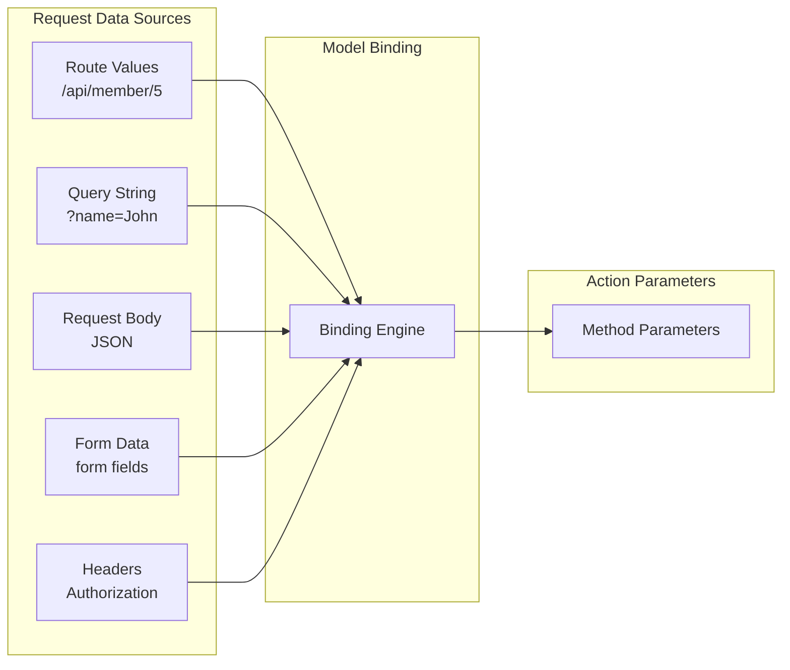
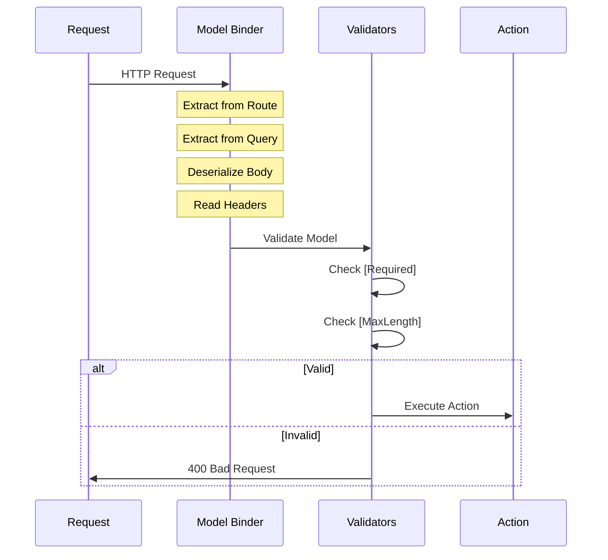

# 📚 Model Binding and Parameter Sources

> **Complete Guide to [FromBody], [FromRoute], [FromQuery] and Data Binding**

---

## 🎯 What is Model Binding?

Model binding is the process of mapping HTTP request data to action method parameters. ASP.NET Core automatically extracts data from various sources and converts them to parameter types.



---

## 📦 Binding Source Attributes

| Attribute | Source | Example |
|-----------|--------|---------|
| `[FromRoute]` | URL path segment | `/api/member/{id}` |
| `[FromQuery]` | Query string | `?page=1&size=10` |
| `[FromBody]` | Request body (JSON) | `{ "name": "John" }` |
| `[FromForm]` | Form data | `multipart/form-data` |
| `[FromHeader]` | HTTP headers | `Authorization: Bearer...` |
| `[FromServices]` | DI container | Inject services |

---

## 🛤️ [FromRoute] - URL Segment Binding

```csharp
// ════════════════════════════════════════════════════════════════════
// FROM ROUTE - Bind from URL path segments
// URL: /api/member/5
// ════════════════════════════════════════════════════════════════════
[HttpGet("{id}")]
public ActionResult<Members> Get([FromRoute] int id)
// Line 1: [FromRoute] binds {id} from URL to parameter
//         - Route: /api/member/5 → id = 5
//         - With [ApiController], [FromRoute] is inferred for route parameters
{
    return member.GetMember(id);
}

// Multiple route parameters
[HttpGet("{departmentId}/employees/{employeeId}")]
public ActionResult<Employee> GetEmployee(
    [FromRoute] int departmentId,
    [FromRoute] int employeeId)
// Line: Both parameters bound from URL
//       /api/hr/10/employees/25 → departmentId=10, employeeId=25
{
    return service.GetEmployee(departmentId, employeeId);
}
```

### Route Parameter with Constraint

```csharp
[HttpGet("{id:int}")]
// Line: :int ensures only integers match
//       /api/member/abc → 404 (doesn't match route)
//       /api/member/5 → id = 5

[HttpGet("{name:alpha:minlength(2)}")]
// Line: Must be alphabetic, at least 2 chars
//       /api/member/Jo → name = "Jo"
//       /api/member/J → 404 (too short)
```

---

## ❓ [FromQuery] - Query String Binding

```csharp
// ════════════════════════════════════════════════════════════════════
// FROM QUERY - Bind from query string
// URL: /api/member?name=John&city=Mumbai
// ════════════════════════════════════════════════════════════════════
[HttpGet]
public ActionResult<IEnumerable<Members>> Search(
    [FromQuery] string name,
    [FromQuery] string city)
// Line 1: [FromQuery] binds from query string
//         - ?name=John&city=Mumbai
//         - name = "John", city = "Mumbai"
{
    return member.Search(name, city);
}

// Optional query parameters with defaults
[HttpGet]
public ActionResult<IEnumerable<Members>> GetPaged(
    [FromQuery] int page = 1,
    [FromQuery] int pageSize = 10)
// Line: Default values if not provided
//       /api/member → page=1, pageSize=10
//       /api/member?page=2 → page=2, pageSize=10
{
    return member.GetPaged(page, pageSize);
}

// Complex type from query
public class SearchFilter
{
    public string? Name { get; set; }
    public string? City { get; set; }
    public int Page { get; set; } = 1;
    public int PageSize { get; set; } = 10;
}

[HttpGet("search")]
public ActionResult<IEnumerable<Members>> Search([FromQuery] SearchFilter filter)
// Line: All properties bound from query string
//       ?Name=John&City=Mumbai&Page=2&PageSize=25
{
    return member.Search(filter);
}
```

---

## 📄 [FromBody] - Request Body Binding

```csharp
// ════════════════════════════════════════════════════════════════════
// FROM BODY - Bind JSON request body to object
// ════════════════════════════════════════════════════════════════════
[HttpPost]
public ActionResult<Members> Post([FromBody] Members newMember)
// Line 1: [FromBody] deserializes JSON to object
//         - Content-Type: application/json
//         - Request body → Members object
//         - With [ApiController], inferred for complex types
{
    return member.Add(newMember);
}
```

**Request:**
```http
POST /api/member HTTP/1.1
Content-Type: application/json

{
    "firstName": "John",
    "lastName": "Doe", 
    "address": "Mumbai"
}
```

### Important [FromBody] Rules

```csharp
// ❌ WRONG - Only ONE [FromBody] parameter allowed
[HttpPost]
public IActionResult Create([FromBody] Member member, [FromBody] Address address)

// ✅ CORRECT - Combine into single object
public class CreateRequest
{
    public Member Member { get; set; }
    public Address Address { get; set; }
}

[HttpPost]
public IActionResult Create([FromBody] CreateRequest request)

// ✅ CORRECT - One from body, others from route/query
[HttpPut("{id}")]
public IActionResult Update(
    [FromRoute] int id,
    [FromBody] Member member)
```

---

## 📝 [FromForm] - Form Data Binding

```csharp
// ════════════════════════════════════════════════════════════════════
// FROM FORM - Bind form data (multipart/form-data)
// ════════════════════════════════════════════════════════════════════
[HttpPost("upload")]
public async Task<IActionResult> Upload([FromForm] IFormFile file)
// Line: Binds uploaded file from form
//       Content-Type: multipart/form-data
{
    if (file.Length > 0)
    {
        using var stream = new FileStream(path, FileMode.Create);
        await file.CopyToAsync(stream);
    }
    return Ok();
}

// Form with multiple fields
public class UploadModel
{
    public string Title { get; set; }
    public string Description { get; set; }
    public IFormFile File { get; set; }
}

[HttpPost("upload-with-data")]
public async Task<IActionResult> UploadWithData([FromForm] UploadModel model)
{
    // model.Title, model.Description, model.File all bound
    return Ok();
}
```

---

## 📨 [FromHeader] - Header Binding

```csharp
// ════════════════════════════════════════════════════════════════════
// FROM HEADER - Bind from HTTP headers
// ════════════════════════════════════════════════════════════════════
[HttpGet]
public IActionResult GetWithApiKey([FromHeader(Name = "X-API-Key")] string apiKey)
// Line: Binds custom header value
//       Header: X-API-Key: abc123 → apiKey = "abc123"
{
    if (string.IsNullOrEmpty(apiKey))
        return Unauthorized();
    return Ok();
}

[HttpGet]
public IActionResult GetWithCorrelation(
    [FromHeader(Name = "X-Correlation-Id")] string? correlationId,
    [FromHeader(Name = "Accept-Language")] string language = "en")
// Line: Optional header with default
{
    correlationId ??= Guid.NewGuid().ToString();
    return Ok(new { correlationId, language });
}
```

---

## 🔧 [FromServices] - Dependency Injection

```csharp
// ════════════════════════════════════════════════════════════════════
// FROM SERVICES - Inject service directly into action
// ════════════════════════════════════════════════════════════════════
[HttpGet]
public IActionResult Get([FromServices] ILogger<MyController> logger)
// Line: Injects service directly into action method
//       Alternative to constructor injection
//       Useful for services needed only in specific actions
{
    logger.LogInformation("Get method called");
    return Ok();
}

// Combine with other sources
[HttpGet("{id}")]
public IActionResult GetById(
    [FromRoute] int id,
    [FromServices] ICacheService cache)
{
    if (cache.TryGet(id, out var cached))
        return Ok(cached);
    
    var data = _repository.Get(id);
    cache.Set(id, data);
    return Ok(data);
}
```

---

## 🤖 Automatic Binding Inference with [ApiController]

When `[ApiController]` is present, binding sources are inferred:

```csharp
[ApiController]
[Route("api/[controller]")]
public class MemberController : ControllerBase
{
    // Route parameters → [FromRoute] (inferred)
    [HttpGet("{id}")]
    public IActionResult Get(int id)  // id bound from route
    
    // Complex types → [FromBody] (inferred)
    [HttpPost]
    public IActionResult Create(Member member)  // member bound from body
    
    // Simple types without route match → [FromQuery] (inferred)
    [HttpGet]
    public IActionResult Search(string name)  // name bound from query
}
```

### Inference Rules

| Parameter Type | Default Binding | Condition |
|---------------|-----------------|-----------|
| Route parameter | `[FromRoute]` | Name matches route template |
| Complex type | `[FromBody]` | Class/struct |
| `IFormFile` | `[FromForm]` | File upload |
| Simple type | `[FromQuery]` | Not in route template |
| Registered service | `[FromServices]` | Exists in DI container |

---

## 📊 Complete Binding Example

```csharp
// ════════════════════════════════════════════════════════════════════
// COMPLETE EXAMPLE - Multiple binding sources
// ════════════════════════════════════════════════════════════════════
[ApiController]
[Route("api/[controller]")]
public class OrderController : ControllerBase
{
    [HttpPost("{customerId}/orders")]
    public async Task<IActionResult> CreateOrder(
        [FromRoute] int customerId,           // From URL: /api/order/5/orders
        [FromQuery] string priority,          // From query: ?priority=high
        [FromBody] OrderRequest order,        // From JSON body
        [FromHeader(Name = "X-Request-Id")] string? requestId,  // From header
        [FromServices] IOrderService orderService)  // From DI
    {
        // customerId = 5 (from /api/order/5/orders)
        // priority = "high" (from ?priority=high)
        // order = { items: [...] } (from JSON body)
        // requestId = "abc-123" (from header)
        // orderService = injected service
        
        var result = await orderService.CreateAsync(customerId, priority, order);
        return CreatedAtAction("GetOrder", new { id = result.Id }, result);
    }
}
```

**Request:**
```http
POST /api/order/5/orders?priority=high HTTP/1.1
Content-Type: application/json
X-Request-Id: abc-123

{
    "items": [
        { "productId": 1, "quantity": 2 },
        { "productId": 3, "quantity": 1 }
    ]
}
```

---

## 🔄 Binding Flow Diagram



---

## 📋 Quick Revision Points

| Attribute | Source | Use Case |
|-----------|--------|----------|
| `[FromRoute]` | URL segment | Resource identifiers |
| `[FromQuery]` | Query string | Filtering, pagination |
| `[FromBody]` | JSON body | Create/update data |
| `[FromForm]` | Form data | File uploads |
| `[FromHeader]` | HTTP headers | API keys, correlation |
| `[FromServices]` | DI container | Action-specific injection |

---

## 🎯 Key Takeaways

1. **[FromRoute]** = URL path segments like `{id}`
2. **[FromQuery]** = Query string like `?page=1`
3. **[FromBody]** = Request body (JSON) - only ONE allowed
4. **[ApiController]** = Automatic inference of binding sources
5. **Complex types** = Automatically bound from body
6. **Simple types** = Bound from route or query
7. **Validation** = Runs automatically after binding

---

## 📚 Interview Questions

**Q1: Can you have multiple [FromBody] parameters?**
> No, only one parameter can be bound from the body. If you need multiple objects, create a wrapper class.

**Q2: How does [ApiController] affect model binding?**
> It enables automatic inference: complex types from body, route parameters from URL, simple types from query string.

**Q3: What is the difference between [FromQuery] and [FromRoute]?**
> [FromRoute] binds from URL path segments (`/api/member/5`). [FromQuery] binds from query string (`?id=5`).

**Q4: When would you use [FromServices]?**
> When you need a service only in a specific action, not the entire controller. Keeps constructor clean for common dependencies.

---

*Next: [08_Repository_Pattern.md](08_Repository_Pattern.md) - Repository Pattern and Data Access Layer*
