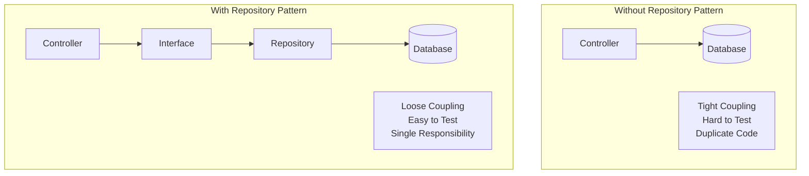
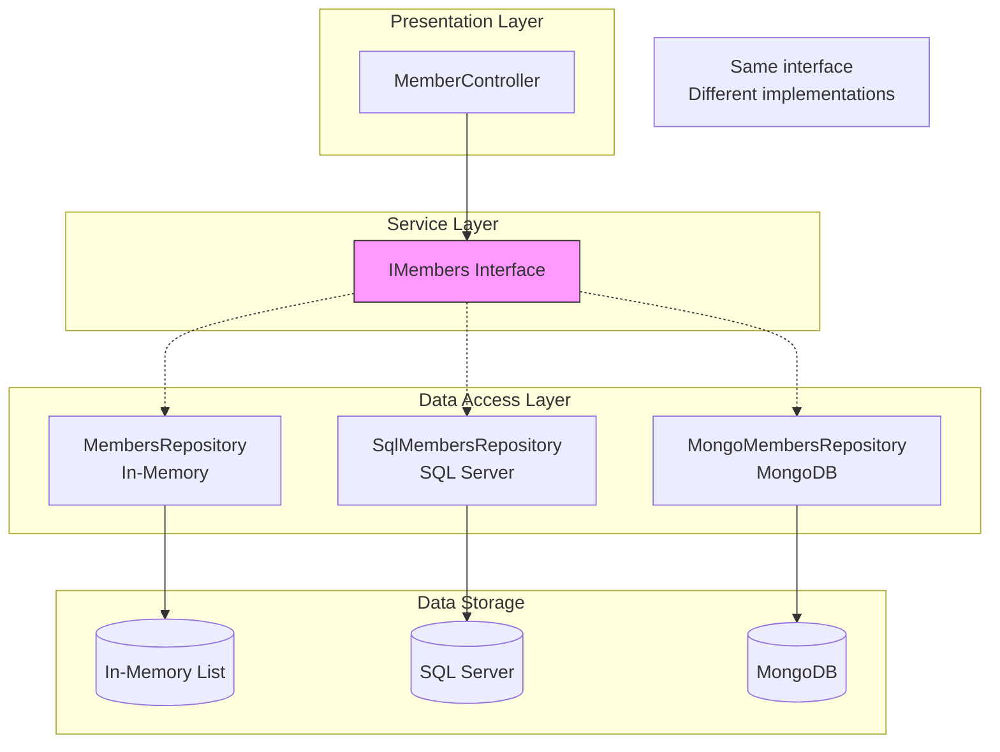

# 📚 Repository Pattern in ASP.NET Core Web API

> **Complete Guide to Interface-Based Data Access Layer Design**

---

## 🎯 What is the Repository Pattern?

The Repository Pattern is a design pattern that **abstracts data access logic** behind an interface, providing a collection-like interface for accessing domain objects.



---

## 🏗️ Core Concepts

### Benefits of Repository Pattern

| Benefit | Description |
|---------|-------------|
| **Testability** | Mock repository for unit tests |
| **Separation of Concerns** | Business logic separate from data access |
| **Single Responsibility** | Each class has one job |
| **Code Reuse** | Data access logic in one place |
| **Loose Coupling** | Controller depends on interface, not implementation |
| **Easy Swapping** | Change from in-memory to SQL without changing controller |

---

## 📝 Complete Implementation

### Step 1: Define the Interface (Contract)

```csharp
// ════════════════════════════════════════════════════════════════════
// FILE: Services/IMembers.cs
// PURPOSE: Define the contract for member data access
// ════════════════════════════════════════════════════════════════════
using APIMemberAPIvirsion08.Models;  // Line 1: Import Models namespace

namespace APIMemberAPIvirsion08.Services  // Line 2: Services namespace
{
    public interface IMembers  // Line 3: Interface definition
    //         - Naming convention: I<EntityName> or I<EntityName>Service
    //         - Defines WHAT operations are available
    //         - Does NOT define HOW they work
    {
        List<Members> GetAllMember();
        // Line 4: Get all members
        //         - Returns List<Members>
        //         - No parameters needed
        
        Members GetMember(int id);
        // Line 5: Get single member by ID
        //         - Returns single Members object
        //         - Returns null if not found
        
        Members Add(Members employee);
        // Line 6: Create new member
        //         - Takes member to add
        //         - Returns created member (with ID)
        
        Members Update(int id, Members MembersChanges);
        // Line 7: Update existing member
        //         - Takes ID and updated data
        //         - Returns updated member
        
        Members Delete(int Id);
        // Line 8: Remove member
        //         - Takes ID to delete
        //         - Returns deleted member (for logging)
        
        List<Members> GetAllMemberbyname(string name);
        // Line 9: Filter by name
        //         - Search/filter operation
        
        List<Members> GetAllMemberbyaddress(string address);
        // Line 10: Filter by address
        //          - Another search operation
    }
}
```

---

### Step 2: Create the Model (Entity)

```csharp
// ════════════════════════════════════════════════════════════════════
// FILE: Models/Members.cs
// PURPOSE: Define the data structure
// ════════════════════════════════════════════════════════════════════
namespace APIMemberAPIvirsion08.Models  // Line 1: Models namespace
{
    public class Members  // Line 2: Entity class
    {
        public int MemberId { get; set; }
        // Line 3: Primary key
        //         - int type for auto-increment
        //         - Convention: <EntityName>Id or just Id
        
        public string FirstName { get; set; }
        // Line 4: First name property
        
        public string LastName { get; set; }
        // Line 5: Last name property
        
        public string Address { get; set; }
        // Line 6: Address property
    }
}
```

---

### Step 3: Implement the Repository

```csharp
// ════════════════════════════════════════════════════════════════════
// FILE: Repository/MembersRepository.cs
// PURPOSE: Implement data access logic (in-memory version)
// ════════════════════════════════════════════════════════════════════
using APIMemberAPIvirsion08.Models;     // Line 1: Import Models
using APIMemberAPIvirsion08.Services;   // Line 2: Import interface
using Microsoft.AspNetCore.Mvc;         // Line 3: For potential ActionResult usage

namespace APIMemberAPIvirsion08.Repository  // Line 4: Repository namespace
{
    public class MembersRepository : IMembers  // Line 5: Implement interface
    //         - Class MUST implement ALL interface methods
    //         - This is the in-memory implementation
    {
        // ══════════════════════════════════════════════════════════
        // STATIC DATA - In-memory storage (for demo)
        // ══════════════════════════════════════════════════════════
        static List<Members> lisMembers = new List<Members>
        // Line 6: Static list persists between requests
        //         - In production, this would be DbContext
        {
            new Members{MemberId=1, FirstName="Kirtesh", LastName="Trivedi", Address="Mumbai" },
            new Members{MemberId=2, FirstName="Nitya", LastName="Shah", Address="Vadodara" },
            new Members{MemberId=3, FirstName="Dilip", LastName="Kothari", Address="Banglore" },
            new Members{MemberId=4, FirstName="Atul", LastName="Ambani", Address="Indore" },
            new Members{MemberId=5, FirstName="Swati", LastName="Zaveri", Address="Mumbai" },
            new Members{MemberId=6, FirstName="Rashmi", LastName="Shah", Address="Ahamdabad" },
        };
        
        // ══════════════════════════════════════════════════════════
        // GET ALL
        // ══════════════════════════════════════════════════════════
        public List<Members> GetAllMember()
        // Line 7: Implement GetAllMember from interface
        {
            return lisMembers;
            // Line 8: Return entire list
            //         - In production: context.Members.ToList()
        }

        // ══════════════════════════════════════════════════════════
        // GET BY ID
        // ══════════════════════════════════════════════════════════
        public Members GetMember(int id)
        // Line 9: Implement GetMember from interface
        {
            return lisMembers.FirstOrDefault(x => x.MemberId == id);
            // Line 10: LINQ query to find by ID
            //          - FirstOrDefault returns null if not found
            //          - Lambda: x => x.MemberId == id
        }
        
        // ══════════════════════════════════════════════════════════
        // ADD (CREATE)
        // ══════════════════════════════════════════════════════════
        public Members Add(Members member)
        // Line 11: Implement Add from interface
        {
            member.MemberId = lisMembers.Max(e => e.MemberId) + 1;
            // Line 12: Auto-generate next ID
            //          - Max() finds highest ID
            //          - +1 gives next available ID
            //          - In production: database auto-increment
            
            lisMembers.Add(member);
            // Line 13: Add to collection
            //          - In production: context.Members.Add(member)
            
            return member;
            // Line 14: Return with generated ID
        }
        
        // ══════════════════════════════════════════════════════════
        // DELETE
        // ══════════════════════════════════════════════════════════
        public Members Delete(int Id)
        // Line 15: Implement Delete from interface
        {
            Members members = lisMembers.FirstOrDefault(e => e.MemberId == Id);
            // Line 16: Find member to delete
            
            if (members != null)
            // Line 17: Only delete if found
            {
                lisMembers.Remove(members);
                // Line 18: Remove from collection
                //          - In production: context.Members.Remove(member)
            }
            return members;
            // Line 19: Return deleted member (null if not found)
        }
        
        // ══════════════════════════════════════════════════════════
        // UPDATE
        // ══════════════════════════════════════════════════════════
        public Members Update(int id, Members memberChanges)
        // Line 20: Implement Update from interface
        {
            Members member = lisMembers.FirstOrDefault(e => e.MemberId == memberChanges.MemberId);
            // Line 21: Find existing member
            
            if (member != null)
            // Line 22: Only update if found
            {
                member.FirstName = memberChanges.FirstName;
                // Line 23: Update first name
                member.LastName = memberChanges.LastName;
                // Line 24: Update last name
                member.Address = memberChanges.Address;
                // Line 25: Update address
                // Note: In-memory objects are reference types
                //       Changes reflect in the list
            }
            return member;
            // Line 26: Return updated member
        }
        
        // ══════════════════════════════════════════════════════════
        // FILTER BY NAME
        // ══════════════════════════════════════════════════════════
        public List<Members> GetAllMemberbyname(string name)
        // Line 27: Implement filter by name
        {
            return lisMembers.FindAll((nm) => nm.FirstName == name);
            // Line 28: FindAll returns all matches
            //          - Lambda predicate for matching
            //          - Returns empty list if no matches
        }
        
        // ══════════════════════════════════════════════════════════
        // FILTER BY ADDRESS
        // ══════════════════════════════════════════════════════════
        public List<Members> GetAllMemberbyaddress(string address)
        // Line 29: Implement filter by address
        {
            return lisMembers.FindAll((nm) => nm.Address == address);
            // Line 30: FindAll with address predicate
        }
    }
}
```

---

### Step 4: Register in DI Container

```csharp
// ════════════════════════════════════════════════════════════════════
// FILE: Program.cs
// PURPOSE: Register repository in Dependency Injection container
// ════════════════════════════════════════════════════════════════════
using APIMemberAPIvirsion08.Repository;  // Import repository
using APIMemberAPIvirsion08.Services;    // Import interface

var builder = WebApplication.CreateBuilder(args);

builder.Services.AddControllers();

builder.Services.AddScoped<IMembers, MembersRepository>();
// Line: Register interface → implementation mapping
//       - IMembers: The interface (abstraction)
//       - MembersRepository: The concrete implementation
//       - AddScoped: New instance per HTTP request
//
//       When controller requests IMembers,
//       DI provides MembersRepository instance

// ... rest of configuration
```

---

### Step 5: Use in Controller

```csharp
// ════════════════════════════════════════════════════════════════════
// FILE: Controllers/MemberController.cs
// PURPOSE: Use repository via dependency injection
// ════════════════════════════════════════════════════════════════════
[Route("api/[controller]")]
[ApiController]
public class MemberController : ControllerBase
{
    private readonly IMembers member;
    // Line 1: Declare interface field (NOT concrete class)
    //         - Controller doesn't know about MembersRepository
    //         - Loose coupling

    public MemberController(IMembers mem)
    // Line 2: Constructor injection
    //         - DI container provides implementation
    //         - No "new MembersRepository()" needed
    {
        member = mem;
        // Line 3: Assign injected service
    }

    [HttpGet]
    public IEnumerable<Members> Get()
    {
        return member.GetAllMember();
        // Line 4: Call interface method
        //         - Doesn't matter which implementation
        //         - Could be in-memory, SQL, MongoDB, etc.
    }
    
    // ... other CRUD methods
}
```

---

## 🔄 Repository with Entity Framework Core

### SQL Server Implementation

```csharp
// ════════════════════════════════════════════════════════════════════
// FILE: Services/SqlEmployeeService.cs
// PURPOSE: Repository using EF Core for SQL Server
// ════════════════════════════════════════════════════════════════════
using API_Two_Table.Models;
using API_Two_Table.Repository;
using Microsoft.EntityFrameworkCore;

namespace API_Two_Table.Services
{
    public class SqlEmployeeService : IEmployeeService
    // Line 1: Implements IEmployeeService interface
    //         - Same interface, different implementation
    {
        private readonly AppdbContextRepository context;
        // Line 2: DbContext for database access
        
        public SqlEmployeeService(AppdbContextRepository context)
        // Line 3: Inject DbContext via constructor
        {
            this.context = context;
        }
        
        public Employee Add(Employee employee)
        {
            context.Employee.Add(employee);
            // Line 4: Add to DbSet (marks for insertion)
            
            context.SaveChanges();
            // Line 5: Execute INSERT SQL
            
            return employee;
        }
        
        public Employee? Delete(int Id)
        {
            Employee? employee = context.Employee.Find(Id);
            // Line 6: Find by primary key
            
            if (employee != null)
            {
                context.Employee.Remove(employee);
                // Line 7: Mark for deletion
                
                context.SaveChanges();
                // Line 8: Execute DELETE SQL
            }
            return employee;
        }
        
        public IEnumerable<Employee> GetAllEmployee()
        {
            return context.Employee.Include(dpt => dpt.Department).ToList();
            // Line 9: Include navigation property (eager loading)
            //         - Joins Employee with Department table
            //         - ToList() executes query
        }
        
        public Employee? GetEmployee(int Id)
        {
            Employee e = context.Employee.FirstOrDefault(m => m.Id == Id);
            // Line 10: LINQ query for single record
            return e;
        }
        
        public Employee Update(Employee employeeChanges)
        {
            Employee e1 = context.Employee.FirstOrDefault(m => m.Id == employeeChanges.Id);
            // Line 11: Get existing entity
            
            context.Entry(e1).State = EntityState.Detached;
            // Line 12: Detach to avoid tracking conflict
            
            context.Update(employeeChanges);
            // Line 13: Attach and mark as modified
            
            context.SaveChanges();
            // Line 14: Execute UPDATE SQL
            
            return employeeChanges;
        }
    }
}
```

---

## 📊 Architecture Diagram



---

## 🔧 Swapping Implementations

```csharp
// Development: Use in-memory repository
if (builder.Environment.IsDevelopment())
{
    builder.Services.AddScoped<IMembers, MembersRepository>();
}
// Production: Use SQL Server repository
else
{
    builder.Services.AddScoped<IMembers, SqlMembersRepository>();
}

// Controller code remains UNCHANGED!
// That's the power of Repository Pattern
```

---

## 📋 Quick Revision Points

| Component | Purpose |
|-----------|---------|
| **Interface** | Defines contract (what operations exist) |
| **Repository** | Implements data access logic |
| **Model** | Data structure/entity |
| **DI Registration** | Maps interface to implementation |
| **Constructor Injection** | Controller receives interface |

---

## 🎯 Key Takeaways

1. **Interface** = Contract defining WHAT operations exist
2. **Repository** = Implementation defining HOW operations work
3. **Controller** depends on interface, not concrete class
4. **DI Container** provides the implementation at runtime
5. **Easy to swap** implementations without changing controller
6. **Testable** - mock the interface for unit tests

---

## 📚 Interview Questions

**Q1: What is the Repository Pattern?**
> A design pattern that abstracts data access behind an interface, providing a collection-like API for accessing data and separating business logic from data access code.

**Q2: Why use Repository Pattern in Web API?**
> Testability (can mock for unit tests), separation of concerns, loose coupling, code reuse, and ability to swap data sources without changing business logic.

**Q3: What is the difference between interface and implementation?**
> Interface defines the contract (method signatures). Implementation provides the actual logic. Controllers depend on interfaces for loose coupling.

**Q4: How do you register a repository in .NET Core?**
> Use `builder.Services.AddScoped<IInterface, Implementation>()` to register the mapping in the DI container.

---

*Next: [09_Dependency_Injection.md](09_Dependency_Injection.md) - Deep Dive into Dependency Injection*
