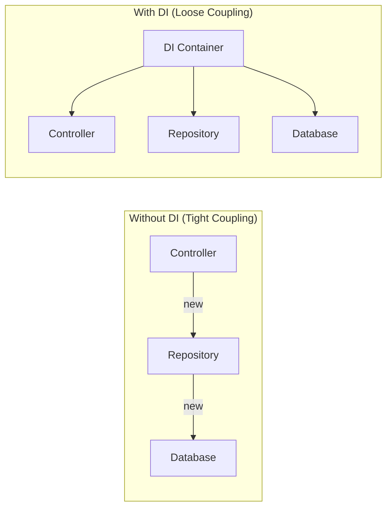
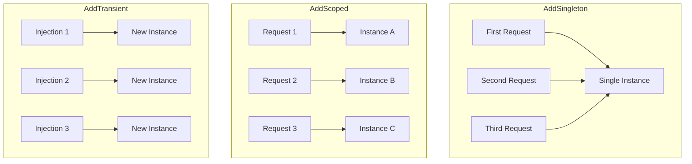
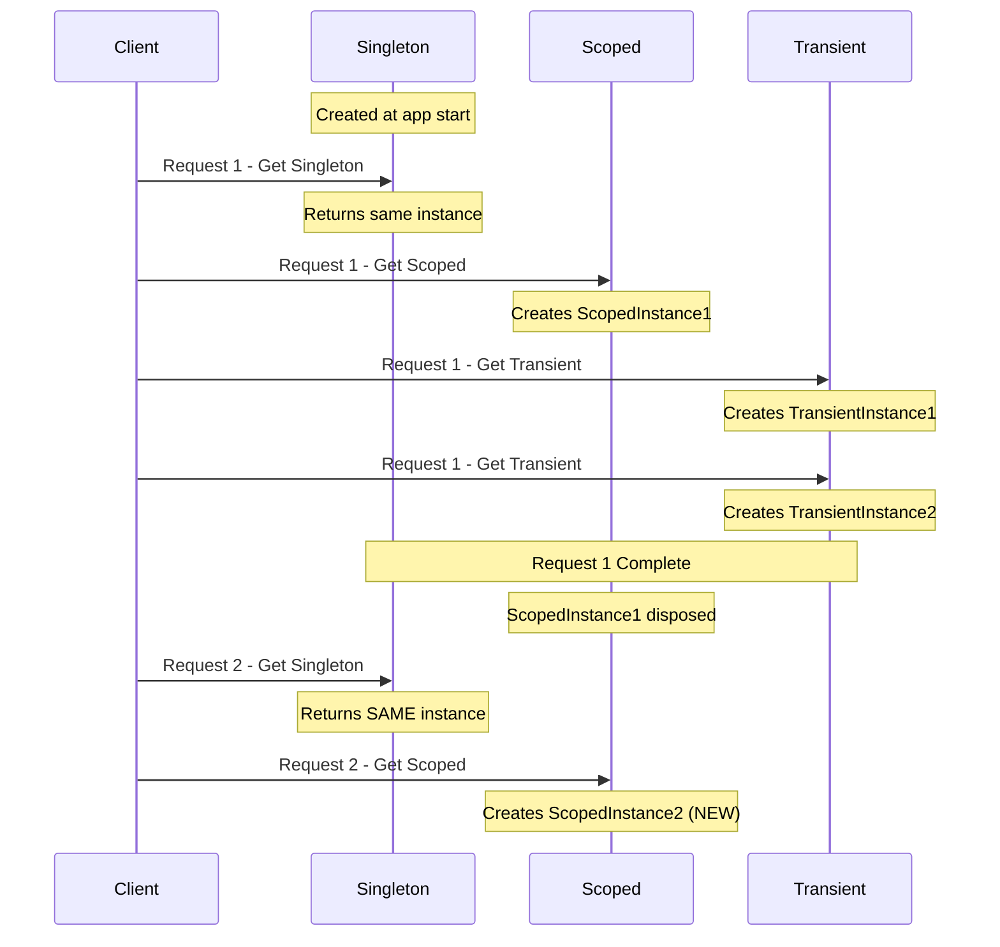

# 📚 Dependency Injection in ASP.NET Core

> **Complete Guide to DI Container, Service Lifetimes, and Constructor Injection**

---

## 🎯 What is Dependency Injection?

**Dependency Injection (DI)** is a design pattern where objects receive their dependencies from an external source rather than creating them internally. ASP.NET Core has a **built-in DI container**.



---

## 🏗️ DI Benefits

| Benefit | Description |
|---------|-------------|
| **Loose Coupling** | Classes depend on interfaces, not implementations |
| **Testability** | Easy to mock dependencies for unit testing |
| **Maintainability** | Change implementation without modifying consumers |
| **Single Responsibility** | Classes don't create their own dependencies |
| **Configuration** | Centralized service configuration |

---

## 📦 Service Lifetimes

ASP.NET Core offers three service lifetimes:



### Lifetime Comparison

| Lifetime | Creates | Use Case | Memory |
|----------|---------|----------|--------|
| **Singleton** | Once per app | Caching, config | Low |
| **Scoped** | Once per request | DbContext, repo | Medium |
| **Transient** | Every time | Stateless services | High |

---

## 🔧 Registration Examples

### AddScoped (Per Request)

```csharp
// ════════════════════════════════════════════════════════════════════
// ADDSCOPED - New instance per HTTP request
// ════════════════════════════════════════════════════════════════════
builder.Services.AddScoped<IMembers, MembersRepository>();
// Line 1: Register scoped service
//         - Same instance throughout ONE HTTP request
//         - Different instance for DIFFERENT requests
//         - Perfect for: DbContext, Repositories, Unit of Work

builder.Services.AddScoped<IEmployeeService, SqlEmployeeService>();
// Line 2: Another scoped service
//         - If injected multiple times in same request,
//         - Same instance is used everywhere

// Example flow:
// Request 1: Creates InstanceA
//   - Controller gets InstanceA
//   - Service also gets InstanceA (same instance)
// Request 2: Creates InstanceB (new instance)
```

---

### AddTransient (Every Time)

```csharp
// ════════════════════════════════════════════════════════════════════
// ADDTRANSIENT - New instance every injection
// ════════════════════════════════════════════════════════════════════
builder.Services.AddTransient<IBookRepository, SqlBookRepository>();
// Line 1: Register transient service
//         - NEW instance EVERY time it's requested
//         - Multiple injections = multiple instances
//         - Perfect for: Lightweight, stateless services

builder.Services.AddTransient<IEmailService, SmtpEmailService>();
// Line 2: Email service as transient
//         - Each send operation gets fresh instance

// Example flow:
// Same request, multiple injections:
//   - Controller gets Instance1
//   - Service gets Instance2 (different instance!)
```

---

### AddSingleton (App Lifetime)

```csharp
// ════════════════════════════════════════════════════════════════════
// ADDSINGLETON - One instance for entire app
// ════════════════════════════════════════════════════════════════════
builder.Services.AddSingleton<ICacheService, MemoryCacheService>();
// Line 1: Register singleton service
//         - ONE instance for entire application lifetime
//         - Shared across ALL requests
//         - Perfect for: Caching, configuration, logging

builder.Services.AddSingleton<IConfigService, AppConfigService>();
// Line 2: Configuration service
//         - Read once, shared everywhere

// ⚠️ WARNING: Be careful with Singleton!
// - Must be thread-safe (concurrent access)
// - Don't hold request-specific state
// - Don't inject Scoped services into Singleton
```

---

## 📝 Complete Program.cs Example

```csharp
// ════════════════════════════════════════════════════════════════════
// FILE: Program.cs
// PURPOSE: Configure all services in DI container
// ════════════════════════════════════════════════════════════════════
using API_Two_Table.Repository;
using API_Two_Table.Services;
using System.Text.Json.Serialization;
using Microsoft.EntityFrameworkCore;

namespace API_Two_Table
{
    public class Program
    {
        public static void Main(string[] args)
        {
            var builder = WebApplication.CreateBuilder(args);

            // ══════════════════════════════════════════════════════
            // FRAMEWORK SERVICES
            // ══════════════════════════════════════════════════════
            builder.Services.AddControllers().AddJsonOptions(options =>
               options.JsonSerializerOptions.ReferenceHandler =
               ReferenceHandler.IgnoreCycles);
            // Line: Add MVC controllers with JSON options
            //       - IgnoreCycles prevents circular reference errors
            
            // ══════════════════════════════════════════════════════
            // DATABASE CONTEXT (Scoped by default)
            // ══════════════════════════════════════════════════════
            builder.Services.AddDbContextPool<AppdbContextRepository>(
                options => options.UseSqlServer(
                    builder.Configuration.GetConnectionString("EmployeeDBConnection")
                )
            );
            // Line: Register DbContext with connection pooling
            //       - AddDbContextPool = Connection pooling (performance)
            //       - Default lifetime: Scoped
            //       - Connection string from appsettings.json
            
            // ══════════════════════════════════════════════════════
            // CUSTOM SERVICES
            // ══════════════════════════════════════════════════════
            builder.Services.AddScoped<IEmployeeService, SqlEmployeeService>();
            // Line: Register repository as scoped
            //       - New instance per HTTP request
            //       - Same instance throughout request
            
            // ══════════════════════════════════════════════════════
            // SWAGGER/OPENAPI
            // ══════════════════════════════════════════════════════
            builder.Services.AddEndpointsApiExplorer();
            builder.Services.AddSwaggerGen();
            
            var app = builder.Build();
            
            // ... middleware configuration
            
            app.Run();
        }
    }
}
```

---

## 💉 Constructor Injection

### Controller Injection

```csharp
// ════════════════════════════════════════════════════════════════════
// CONSTRUCTOR INJECTION IN CONTROLLER
// ════════════════════════════════════════════════════════════════════
[Route("api/[controller]")]
[ApiController]
public class MemberController : ControllerBase
{
    private readonly IMembers member;
    // Line 1: Declare as readonly interface
    //         - readonly = can only assign in constructor
    //         - IMembers = interface, not implementation

    public MemberController(IMembers mem)
    // Line 2: Constructor parameter
    //         - DI container automatically provides instance
    //         - No "new" keyword - loosely coupled
    {
        member = mem;
        // Line 3: Assign to field
    }

    [HttpGet]
    public IEnumerable<Members> Get()
    {
        return member.GetAllMember();
        // Line 4: Use injected service
    }
}
```

### Multiple Dependencies

```csharp
// ════════════════════════════════════════════════════════════════════
// MULTIPLE DEPENDENCIES
// ════════════════════════════════════════════════════════════════════
public class OrderController : ControllerBase
{
    private readonly IOrderService _orderService;
    private readonly ICustomerService _customerService;
    private readonly ILogger<OrderController> _logger;
    
    public OrderController(
        IOrderService orderService,
        ICustomerService customerService,
        ILogger<OrderController> logger)
    // Line: Multiple dependencies injected
    //       - Order doesn't matter
    //       - All resolved by DI container
    {
        _orderService = orderService;
        _customerService = customerService;
        _logger = logger;
    }
}
```

---

## 🔧 Other Injection Types

### Method Injection ([FromServices])

```csharp
// ════════════════════════════════════════════════════════════════════
// METHOD INJECTION - Inject into specific action
// ════════════════════════════════════════════════════════════════════
[HttpGet]
public IActionResult GetWithLogging([FromServices] ILogger<MyController> logger)
// Line: Inject service directly into action method
//       - Useful for services needed only in specific actions
//       - Keeps constructor clean
{
    logger.LogInformation("Method called");
    return Ok();
}
```

### Property Injection (Not Recommended)

```csharp
// ⚠️ NOT RECOMMENDED - Use constructor injection instead
public class MyController : ControllerBase
{
    [FromServices]
    public IMyService Service { get; set; }  // Property injection
    
    // Problems:
    // - Nullable (might not be set)
    // - Hidden dependency
    // - Harder to test
}
```

---

## 📊 Lifetime Diagram



---

## ⚠️ Common DI Mistakes

### ❌ Captive Dependency

```csharp
// ⚠️ WRONG - Singleton captures Scoped service
builder.Services.AddSingleton<ISingletonService, SingletonService>();
builder.Services.AddScoped<IScopedService, ScopedService>();

public class SingletonService : ISingletonService
{
    private readonly IScopedService _scoped;  // ❌ CAPTURED!
    
    public SingletonService(IScopedService scoped)
    {
        _scoped = scoped;  // Scoped service lives beyond its intended lifetime
    }
}
```

### ✅ Correct Approach

```csharp
// ✅ Use IServiceProvider to resolve scoped services when needed
public class SingletonService : ISingletonService
{
    private readonly IServiceProvider _provider;
    
    public SingletonService(IServiceProvider provider)
    {
        _provider = provider;
    }
    
    public void DoWork()
    {
        using var scope = _provider.CreateScope();
        var scoped = scope.ServiceProvider.GetRequiredService<IScopedService>();
        // Now scoped service has proper lifetime
    }
}
```

---

## 📋 Lifetime Selection Guide

| Scenario | Lifetime |
|----------|----------|
| DbContext | **Scoped** |
| Repository | **Scoped** |
| Unit of Work | **Scoped** |
| HTTP Client | **Transient** or Singleton with `IHttpClientFactory` |
| Cache Service | **Singleton** |
| Configuration | **Singleton** |
| Logger | **Singleton** (built-in) |
| Email Service | **Transient** |
| File Upload | **Transient** |

---

## 📋 Quick Revision Points

| Concept | Key Point |
|---------|-----------|
| **DI Container** | Built into ASP.NET Core |
| **Constructor Injection** | Primary method for receiving dependencies |
| **AddScoped** | One per HTTP request |
| **AddTransient** | New every time requested |
| **AddSingleton** | One for entire app lifetime |
| **Interface** | Depend on interfaces, not implementations |

---

## 🎯 Key Takeaways

1. **DI Container** = Built into ASP.NET Core
2. **Constructor Injection** = Primary injection method
3. **Scoped** = Per HTTP request (use for DbContext, repos)
4. **Transient** = New instance every time
5. **Singleton** = One instance for app lifetime
6. **Avoid** injecting Scoped into Singleton

---

## 📚 Interview Questions

**Q1: What is the difference between AddScoped, AddTransient, and AddSingleton?**
> - Scoped: One instance per HTTP request
> - Transient: New instance every time requested
> - Singleton: One instance for entire application lifetime

**Q2: Why use Dependency Injection?**
> Loose coupling, testability, maintainability, and following SOLID principles (Dependency Inversion).

**Q3: What is Constructor Injection?**
> Dependencies are passed through the constructor, automatically resolved by the DI container. It's the preferred method for receiving dependencies.

**Q4: What is a captive dependency?**
> When a Singleton captures a Scoped or Transient service, causing it to live beyond its intended lifetime. This can cause bugs and memory issues.

---

*Next: [10_Entity_Framework_Core.md](10_Entity_Framework_Core.md) - Entity Framework Core and Database Access*
