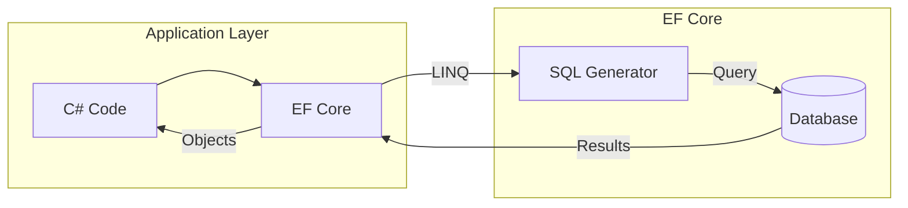
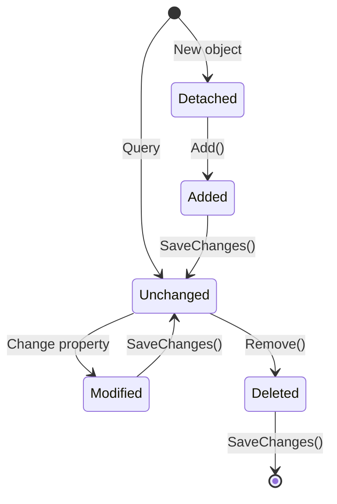

# 📚 Entity Framework Core in ASP.NET Core Web API

> **Complete Guide to DbContext, DbSet, and Database Operations**

---

## 🎯 What is Entity Framework Core?

**Entity Framework Core (EF Core)** is Microsoft's modern ORM (Object-Relational Mapper) that enables .NET developers to work with databases using .NET objects, eliminating the need for most data-access code.



---

## 🏗️ Core Concepts

| Concept | Description |
|---------|-------------|
| **DbContext** | Session with database, unit of work |
| **DbSet<T>** | Collection representing table |
| **Entity** | C# class mapped to table |
| **LINQ** | Query syntax for accessing data |
| **Migrations** | Version control for schema |
| **Change Tracking** | Automatic tracking of entity changes |

---

## 📦 Setting Up DbContext

### Complete DbContext Implementation

```csharp
// ════════════════════════════════════════════════════════════════════
// FILE: Repository/AppdbContextRepository.cs
// PURPOSE: Database context for EF Core
// ════════════════════════════════════════════════════════════════════
using API_Two_Table.Models;        // Line 1: Import entity models
using Microsoft.EntityFrameworkCore;  // Line 2: EF Core namespace
using System.Collections.Generic;     // Line 3: For collections

namespace API_Two_Table.Repository    // Line 4: Repository namespace
{
    public class AppdbContextRepository : DbContext
    // Line 5: Inherit from DbContext
    //         - DbContext = Session with database
    //         - Unit of Work pattern
    //         - Manages connections, transactions, change tracking
    {
        public AppdbContextRepository(DbContextOptions<AppdbContextRepository> options)
             : base(options)
        // Line 6: Constructor injection
        //         - DbContextOptions contains connection string
        //         - Passed to base DbContext constructor
        //         - Configured in Program.cs
        {
        }

        public DbSet<Employee> Employee { get; set; }
        // Line 7: DbSet represents table
        //         - Employee table in database
        //         - IQueryable<Employee> for LINQ
        //         - Add, Remove, Find operations
        
        public DbSet<Department> Department { get; set; }
        // Line 8: Another table
        //         - Department table
        //         - Navigation properties link tables
    }
}
```

---

### Advanced DbContext with Fluent API

```csharp
// ════════════════════════════════════════════════════════════════════
// FILE: Repository/AppdbContext.cs 
// PURPOSE: DbContext with Fluent API configuration
// ════════════════════════════════════════════════════════════════════
using APIAsync.Models;
using Microsoft.EntityFrameworkCore;

namespace APIAsync.Repository
{
    public class AppdbContext : DbContext
    {
        public AppdbContext(DbContextOptions<AppdbContext> options) : base(options)
        {
        }
        
        protected override void OnModelCreating(ModelBuilder modelBuilder)
        // Line 1: Override for Fluent API configuration
        //         - Called when model is being created
        //         - Configure relationships, constraints, etc.
        {
            modelBuilder.Entity<Book>()
            // Line 2: Configure Book entity
            
                .HasOne<Author>()
                // Line 3: Book has ONE Author (navigation)
                //         - Many-to-One relationship
                
                .WithMany()
                // Line 4: Author has MANY Books
                //         - One-to-Many from Author side
                
                .HasForeignKey(b => b.AuthorId)
                // Line 5: Foreign key property
                //         - AuthorId column in Book table
                
                .OnDelete(DeleteBehavior.Cascade);
                // Line 6: Cascade delete behavior
                //         - Delete author → delete all books

            base.OnModelCreating(modelBuilder);
            // Line 7: Call base implementation
        }

        public DbSet<Book> Books { get; set; }
        // Line 8: Books table
        
        public DbSet<Author> Authors { get; set; }
        // Line 9: Authors table
    }
}
```

---

## 📝 Entity Models

### Basic Entity

```csharp
// ════════════════════════════════════════════════════════════════════
// FILE: Models/Employee.cs
// PURPOSE: Entity with validation and navigation
// ════════════════════════════════════════════════════════════════════
using System.ComponentModel;
using System.ComponentModel.DataAnnotations;
using System.Text.Json.Serialization;

namespace API_Two_Table.Models
{
    public class Employee
    {
        public int Id { get; set; }
        // Line 1: Primary key
        //         - Convention: "Id" or "<EntityName>Id"
        //         - Auto-detected as primary key
        
        [Required]
        // Line 2: Validation - field cannot be null
        
        [DisplayName("Employee Name")]
        // Line 3: Display label for MVC views
        
        public string? Name { get; set; }
        // Line 4: Nullable string (? = nullable reference)
        
        [Required]
        [DataType(DataType.EmailAddress)]
        // Line 5: Semantic type hint for validation
        
        public string? Email { get; set; }
        
        [DisplayName("Department Id")]
        public int DepartmentId { get; set; }
        // Line 6: Foreign key property
        //         - Links to Department table
        //         - Convention: <NavigationProperty>Id

        [JsonIgnore]
        // Line 7: Exclude from JSON serialization
        //         - Prevents circular reference
        
        public Department? Department { get; set; }
        // Line 8: Navigation property
        //         - Virtual = lazy loading (if enabled)
        //         - Used for Include() eager loading
    }
}
```

### Entity with Explicit Foreign Key

```csharp
// ════════════════════════════════════════════════════════════════════
// FILE: Models/Book.cs
// PURPOSE: Entity with explicit ForeignKey attribute
// ════════════════════════════════════════════════════════════════════
using System.ComponentModel.DataAnnotations;
using System.ComponentModel.DataAnnotations.Schema;
using APIAsync.Models;

public class Book
{
    [Key]
    // Line 1: Explicit primary key attribute
    //         - Not needed if property is named "Id"
    
    public int BookId { get; set; }

    [MaxLength(25)]
    // Line 2: Maximum characters in database column
    //         - VARCHAR(25) in SQL Server
    
    [MinLength(6, ErrorMessage = "title must be at least 6 characters long")]
    // Line 3: Minimum length validation with custom message
    
    public string? Title { get; set; }

    [ForeignKey("Author")]
    // Line 4: Explicit foreign key attribute
    //         - "Author" = name of navigation property
    //         - Links AuthorId to Author property
    
    public int AuthorId { get; set; }
    // Line 5: Foreign key column
    
    public Author? Author { get; set; }
    // Line 6: Navigation property
    //         - Loaded with Include()

    [Required(ErrorMessage = "ISBN Required")]
    // Line 7: Required with custom error message
    
    public string? Isbn { get; set; }
}
```

### Parent Entity with Collection

```csharp
// ════════════════════════════════════════════════════════════════════
// FILE: Models/Department.cs
// PURPOSE: Parent entity with collection navigation
// ════════════════════════════════════════════════════════════════════
namespace API_Two_Table.Models
{
    public class Department
    {
        public int Id { get; set; }
        // Line 1: Primary key

        public string? Name { get; set; }
        // Line 2: Department name
        
        public ICollection<Employee>? Employees { get; set; }
        // Line 3: Collection navigation property
        //         - One Department has MANY Employees
        //         - ICollection<T> for one-to-many
        //         - Used for reverse navigation
    }
}
```

---

## ⚙️ Registering DbContext

```csharp
// ════════════════════════════════════════════════════════════════════
// FILE: Program.cs
// PURPOSE: Register DbContext with DI container
// ════════════════════════════════════════════════════════════════════
using API_Two_Table.Repository;
using Microsoft.EntityFrameworkCore;

var builder = WebApplication.CreateBuilder(args);

// Method 1: AddDbContextPool (Recommended for performance)
builder.Services.AddDbContextPool<AppdbContextRepository>(
    options => options.UseSqlServer(
        builder.Configuration.GetConnectionString("EmployeeDBConnection")
    )
);
// Line: Connection pooling for better performance
//       - Reuses existing connections
//       - Reduces connection overhead
//       - Default lifetime: Scoped

// Method 2: AddDbContext (Standard)
builder.Services.AddDbContext<AppdbContext>((options) => 
    options.UseSqlServer(
        builder.Configuration.GetConnectionString("BookDatabase")
    )
);
// Line: Standard DbContext registration
//       - New connection per request
//       - Scoped lifetime by default
```

---

## 🗃️ Connection String Configuration

```json
// ════════════════════════════════════════════════════════════════════
// FILE: appsettings.json
// PURPOSE: Store connection strings
// ════════════════════════════════════════════════════════════════════
{
  "ConnectionStrings": {
    "EmployeeDBConnection": "Data Source=(localdb)\\ProjectModels;Initial Catalog=Demoempdept;Integrated Security=True"
  },
  "Logging": {
    "LogLevel": {
      "Default": "Information"
    }
  }
}
```

### Connection String Parts

| Part | Description |
|------|-------------|
| `Data Source` | Server name (localdb, localhost, server.com) |
| `Initial Catalog` | Database name |
| `Integrated Security` | Windows authentication (True/False) |
| `User ID` | SQL Server username (if not Windows auth) |
| `Password` | SQL Server password (if not Windows auth) |

---

## 🔧 CRUD Operations with EF Core

### Complete Service Implementation

```csharp
// ════════════════════════════════════════════════════════════════════
// FILE: Services/SqlEmployeeService.cs
// PURPOSE: Repository using EF Core
// ════════════════════════════════════════════════════════════════════
using API_Two_Table.Models;
using API_Two_Table.Repository;
using Microsoft.EntityFrameworkCore;

namespace API_Two_Table.Services
{
    public class SqlEmployeeService : IEmployeeService
    {
        private readonly AppdbContextRepository context;
        // Line 1: DbContext injected via DI
        
        public SqlEmployeeService(AppdbContextRepository context)
        {
            this.context = context;
            // Line 2: Assign to field
        }
        
        // ══════════════════════════════════════════════════════════
        // CREATE
        // ══════════════════════════════════════════════════════════
        public Employee Add(Employee employee)
        {
            context.Employee.Add(employee);
            // Line 3: Add entity to DbSet
            //         - EntityState = Added
            //         - Not in database yet
            
            context.SaveChanges();
            // Line 4: Execute INSERT SQL
            //         - Persists to database
            //         - Auto-generated ID assigned
            
            return employee;
            // Line 5: Return with generated ID
        }
        
        // ══════════════════════════════════════════════════════════
        // READ (ALL)
        // ══════════════════════════════════════════════════════════
        public IEnumerable<Employee> GetAllEmployee()
        {
            return context.Employee
                .Include(dpt => dpt.Department)
                // Line 6: Eager loading
                //         - JOIN with Department table
                //         - Prevents N+1 query problem
                
                .ToList();
                // Line 7: Execute query
                //         - Materializes results to List
        }
        
        // ══════════════════════════════════════════════════════════
        // READ (SINGLE)
        // ══════════════════════════════════════════════════════════
        public Employee? GetEmployee(int Id)
        {
            Employee e = context.Employee.FirstOrDefault(m => m.Id == Id);
            // Line 8: Find by predicate
            //         - FirstOrDefault returns null if not found
            
            return e;
        }
        
        // Alternative: Using Find
        // context.Employee.Find(Id);
        // - Find() uses primary key
        // - Checks cache first
        // - Only works with primary key
        
        // ══════════════════════════════════════════════════════════
        // UPDATE
        // ══════════════════════════════════════════════════════════
        public Employee Update(Employee employeeChanges)
        {
            Employee e1 = context.Employee
                .FirstOrDefault(m => m.Id == employeeChanges.Id);
            // Line 9: Get existing entity (tracked)
            
            context.Entry(e1).State = EntityState.Detached;
            // Line 10: Detach existing entity
            //          - Prevents tracking conflict
            //          - Can't have two tracked entities with same key
            
            context.Update(employeeChanges);
            // Line 11: Attach and mark as Modified
            //          - All properties will be updated
            
            context.SaveChanges();
            // Line 12: Execute UPDATE SQL
            
            return employeeChanges;
        }
        
        // ══════════════════════════════════════════════════════════
        // DELETE
        // ══════════════════════════════════════════════════════════
        public Employee? Delete(int Id)
        {
            Employee? employee = context.Employee.Find(Id);
            // Line 13: Find by primary key
            
            if (employee != null)
            {
                context.Employee.Remove(employee);
                // Line 14: Mark for deletion
                //          - EntityState = Deleted
                
                context.SaveChanges();
                // Line 15: Execute DELETE SQL
            }
            return employee;
        }
        
        // ══════════════════════════════════════════════════════════
        // RELATED DATA
        // ══════════════════════════════════════════════════════════
        public IEnumerable<Department> GetAllDepartment()
        {
            return context.Department;
            // Line 16: Return all departments
            //          - IQueryable<Department>
        }
    }
}
```

---

## 🔄 Async Operations

```csharp
// ════════════════════════════════════════════════════════════════════
// FILE: Services/SqlBookRepository.cs
// PURPOSE: Async repository implementation
// ════════════════════════════════════════════════════════════════════
using APIAsync.Repository;
using Microsoft.EntityFrameworkCore;

namespace APIAsync.Services
{
    public class SqlBookRepository : IBookRepository
    {
        public readonly AppdbContext _context;
        
        public SqlBookRepository(AppdbContext context)
        {
            _context = context;
        }

        // ══════════════════════════════════════════════════════════
        // ASYNC CREATE
        // ══════════════════════════════════════════════════════════
        public async Task<Book> AddAsync(Book book)
        {
            await _context.Books.AddAsync(book);
            // Line 1: async version of Add
            //         - Generally not needed for Add
            //         - Useful for value generation
            
            await _context.SaveChangesAsync();
            // Line 2: Async save
            //         - Non-blocking database call
            //         - Thread returns to pool during I/O
            
            return book;
        }

        // ══════════════════════════════════════════════════════════
        // ASYNC READ (SINGLE)
        // ══════════════════════════════════════════════════════════
        public async Task<Book?> GetByIdAsync(int id)
        {
            return await _context.Books
                .Include(b => b.Author)
                // Line 3: Include related Author
                
                .FirstOrDefaultAsync(b => b.BookId == id);
                // Line 4: Async query execution
        }

        // ══════════════════════════════════════════════════════════
        // ASYNC READ (ALL)
        // ══════════════════════════════════════════════════════════
        public async Task<List<Book>> GetAllAsync()
        {
            return await _context.Books
                .Include(b => b.Author)
                .ToListAsync();
            // Line 5: ToListAsync for async execution
        }

        // ══════════════════════════════════════════════════════════
        // ASYNC UPDATE
        // ══════════════════════════════════════════════════════════
        public async Task<Book?> UpdateAsync(int id, Book updatedBook)
        {
            var existingBook = await _context.Books.FindAsync(id);
            // Line 6: Async Find
            
            if (existingBook == null)
                return null;

            updatedBook.BookId = id;
            // Line 7: Ensure ID from route is used

            _context.Entry(existingBook).CurrentValues.SetValues(updatedBook);
            // Line 8: Update only changed properties
            //         - More efficient than full Update
            
            await _context.SaveChangesAsync();
            // Line 9: Async save
            
            return existingBook;
        }

        // ══════════════════════════════════════════════════════════
        // ASYNC DELETE
        // ══════════════════════════════════════════════════════════
        public async Task<Book?> DeleteAsync(int id)
        {
            var book = await _context.Books.FindAsync(id);
            
            if (book == null)
                return null;

            _context.Books.Remove(book);
            await _context.SaveChangesAsync();
            
            return book;
        }
    }
}
```

---

## 📊 Change Tracking



| State | Description | SaveChanges Action |
|-------|-------------|-------------------|
| **Detached** | Not tracked by context | None |
| **Unchanged** | Tracked, no changes | None |
| **Added** | New entity | INSERT |
| **Modified** | Properties changed | UPDATE |
| **Deleted** | Marked for removal | DELETE |

---

## 📋 Quick Revision Points

| Concept | Key Point |
|---------|-----------|
| **DbContext** | Database session, unit of work |
| **DbSet<T>** | Table representation |
| **SaveChanges()** | Persist changes to database |
| **Include()** | Eager loading (JOIN) |
| **Find()** | Lookup by primary key |
| **Add()** | Mark entity for INSERT |
| **Remove()** | Mark entity for DELETE |
| **Update()** | Mark entity for UPDATE |

---

## 🎯 Key Takeaways

1. **DbContext** = Session with database
2. **DbSet<T>** = Represents a table
3. **SaveChanges()** = Persists all tracked changes
4. **Include()** = Eager loading for related data
5. **Async methods** = Better scalability
6. **Change Tracking** = EF knows what's modified

---

## 📚 Interview Questions

**Q1: What is DbContext in Entity Framework Core?**
> DbContext represents a session with the database, acts as a Unit of Work, manages entity change tracking, and provides SaveChanges() to persist changes.

**Q2: What is the difference between Find() and FirstOrDefault()?**
> Find() uses primary key, checks local cache first, and only works with primary key. FirstOrDefault() uses any predicate and always queries the database.

**Q3: What is eager loading?**
> Loading related data in the same query using Include(). Prevents N+1 query problem where separate queries are made for each related entity.

**Q4: Why use async methods in EF Core?**
> Async methods free up threads during database I/O, improving scalability. The thread returns to the pool while waiting for the database response.

---

*Next: [11_Async_Await_WebAPI.md](11_Async_Await_WebAPI.md) - Deep Dive into Async/Await Pattern*
