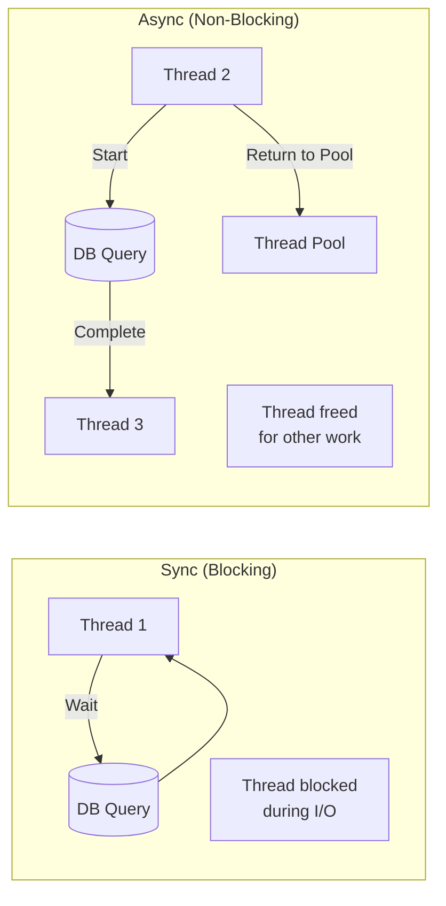
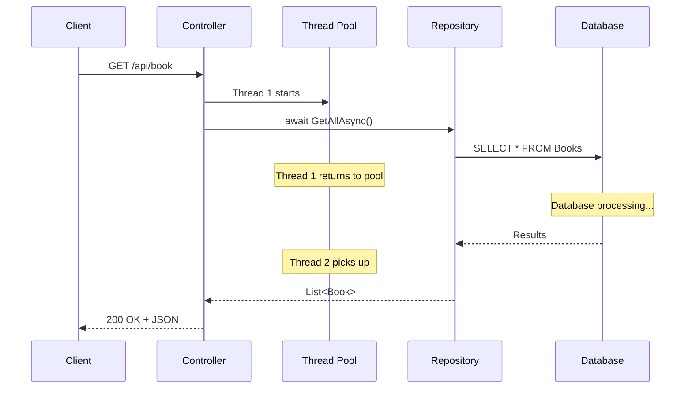

# 📚 Async/Await in ASP.NET Core Web API

> **Complete Guide to Asynchronous Programming for Scalable APIs**

---

## 🎯 Why Async in Web APIs?

Async programming allows your application to handle more concurrent requests by **freeing threads during I/O operations**.



### Sync vs Async Performance

| Scenario | Sync | Async |
|----------|------|-------|
| 100 concurrent requests | 100 threads needed | ~10 threads needed |
| Thread pool exhaustion | Possible | Unlikely |
| Memory usage | Higher | Lower |
| Scalability | Limited | Excellent |

---

## 📝 Async Controller Actions

### Complete Async Controller

```csharp
// ════════════════════════════════════════════════════════════════════
// FILE: Controllers/BookController.cs
// PURPOSE: Async CRUD operations
// ════════════════════════════════════════════════════════════════════
using AsynctwotableAPI.Models;
using Microsoft.AspNetCore.Mvc;
using AsynctwotableAPI.Services;

namespace AsynctwotableAPI.Controllers
{
    [ApiController]
    [Route("api/[controller]")]
    public class BookController : ControllerBase
    {
        private readonly IBookRepository _bookRepository;

        public BookController(IBookRepository bookRepository)
        {
            _bookRepository = bookRepository;
        }

        // ══════════════════════════════════════════════════════════
        // ASYNC GET ALL
        // ══════════════════════════════════════════════════════════
        [HttpGet]
        public async Task<ActionResult<IEnumerable<Book>>> GetAllBooks()
        // Line 1: async = Method can use await
        // Line 2: Task<T> = Async return wrapper
        //         - Represents an ongoing operation
        //         - T = The actual return type
        // Line 3: ActionResult<T> = Type safety + status codes
        {
            var books = await _bookRepository.GetAllAsync();
            // Line 4: await = Non-blocking wait
            //         - Thread returns to pool
            //         - Continues when DB responds
            
            return Ok(books);
            // Line 5: 200 OK with book list
        }

        // ══════════════════════════════════════════════════════════
        // ASYNC GET BY ID
        // ══════════════════════════════════════════════════════════
        [HttpGet("{id}")]
        public async Task<ActionResult<Book>> GetBookById(int id)
        {
            var book = await _bookRepository.GetByIdAsync(id);
            // Line: await async repository call
            
            if (book == null)
                return NotFound();
            // Line: 404 if not found

            return Ok(book);
            // Line: 200 OK with book
        }

        // ══════════════════════════════════════════════════════════
        // ASYNC POST (CREATE)
        // ══════════════════════════════════════════════════════════
        [HttpPost]
        public async Task<ActionResult<Book>> AddBook(Book book)
        {
            var createdBook = await _bookRepository.AddAsync(book);
            // Line: Async add to database
            
            return CreatedAtAction(nameof(GetBookById), new { id = createdBook.BookId }, createdBook);
            // Line: 201 Created with Location header
        }

        // ══════════════════════════════════════════════════════════
        // ASYNC PUT (UPDATE)
        // ══════════════════════════════════════════════════════════
        [HttpPut("{id}")]
        public async Task<ActionResult<Book>> UpdateBook(int id, Book book)
        {
            var updatedBook = await _bookRepository.UpdateAsync(id, book);
            // Line: Async update
            
            if (updatedBook == null)
                return NotFound();

            return Ok(updatedBook);
        }

        // ══════════════════════════════════════════════════════════
        // ASYNC DELETE
        // ══════════════════════════════════════════════════════════
        [HttpDelete("{id}")]
        public async Task<ActionResult<Book>> DeleteBook(int id)
        {
            var deletedBook = await _bookRepository.DeleteAsync(id);
            
            if (deletedBook == null)
                return NotFound();

            return Ok(deletedBook);
        }
    }
}
```

---

## 🔧 Async Repository Interface

```csharp
// ════════════════════════════════════════════════════════════════════
// FILE: Services/IBookRepository.cs
// PURPOSE: Async interface definition
// ════════════════════════════════════════════════════════════════════
namespace AsynctwotableAPI.Services
{
    public interface IBookRepository
    {
        Task<Book> AddAsync(Book book);
        // Line 1: Returns Task<Book>
        //         - Caller must await
        
        Task<Book?> GetByIdAsync(int id);
        // Line 2: Nullable return for not found
        
        Task<List<Book>> GetAllAsync();
        // Line 3: Returns Task<List<Book>>
        
        Task<Book?> UpdateAsync(int id, Book updatedBook);
        // Line 4: Nullable for not found
        
        Task<Book?> DeleteAsync(int id);
        // Line 5: Nullable for not found
    }
}
```

---

## 📦 Async Repository Implementation

```csharp
// ════════════════════════════════════════════════════════════════════
// FILE: Services/SqlBookRepository.cs
// PURPOSE: Async EF Core implementation
// ════════════════════════════════════════════════════════════════════
using AsynctwotableAPI.Models;
using AsynctwotableAPI.Repository;
using Microsoft.EntityFrameworkCore;

namespace AsynctwotableAPI.Services
{
    public class SqlBookRepository : IBookRepository
    {
        private readonly AppdbContext _context;

        public SqlBookRepository(AppdbContext context)
        {
            _context = context;
        }

        public async Task<Book> AddAsync(Book book)
        {
            await _context.Books.AddAsync(book);
            // Line 1: Async Add
            //         - Generally not needed (Add is fast)
            //         - Required for value generation scenarios
            
            await _context.SaveChangesAsync();
            // Line 2: Async save - THIS is the important async call
            //         - Actual database I/O
            //         - Thread freed during database write
            
            return book;
        }

        public async Task<Book?> GetByIdAsync(int id)
        {
            return await _context.Books.FindAsync(id);
            // Line: FindAsync - Primary key lookup
            //       - Checks cache first
            //       - Async database query
        }

        public async Task<List<Book>> GetAllAsync()
        {
            return await _context.Books.ToListAsync();
            // Line: ToListAsync - Async query execution
            //       - Materializes all results
            //       - Thread freed during query
        }

        public async Task<Book?> UpdateAsync(int id, Book updatedBook)
        {
            if (id != updatedBook.BookId)
                return null;
            // Line: Validate ID match

            var existingBook = await _context.Books.FindAsync(id);
            // Line: Async find
            
            if (existingBook == null)
                return null;

            _context.Entry(existingBook).CurrentValues.SetValues(updatedBook);
            // Line: Update only changed values
            //       - More efficient than Replace
            
            await _context.SaveChangesAsync();
            // Line: Async save
            
            return existingBook;
        }

        public async Task<Book?> DeleteAsync(int id)
        {
            var book = await _context.Books.FindAsync(id);
            // Line: Async find
            
            if (book == null)
                return null;

            _context.Books.Remove(book);
            // Line: Mark for deletion (sync is fine)
            
            await _context.SaveChangesAsync();
            // Line: Async delete
            
            return book;
        }
    }
}
```

---

## 📊 Async Execution Flow



---

## ⚠️ Common Async Mistakes

### ❌ Async Void

```csharp
// ❌ WRONG - async void (fire and forget)
[HttpPost]
public async void CreateBook(Book book)  // DON'T DO THIS
{
    await _repository.AddAsync(book);
    // Exceptions can't be caught
    // Caller can't await
}

// ✅ CORRECT - async Task
[HttpPost]
public async Task<IActionResult> CreateBook(Book book)
{
    var result = await _repository.AddAsync(book);
    return Ok(result);
}
```

### ❌ Blocking on Async

```csharp
// ❌ WRONG - Blocking with .Result or .Wait()
[HttpGet]
public IActionResult GetBooks()
{
    var books = _repository.GetAllAsync().Result;  // DEADLOCK RISK!
    return Ok(books);
}

// ✅ CORRECT - async all the way
[HttpGet]
public async Task<IActionResult> GetBooks()
{
    var books = await _repository.GetAllAsync();
    return Ok(books);
}
```

---

## 📋 EF Core Async Methods

| Sync Method | Async Method |
|-------------|--------------|
| `ToList()` | `ToListAsync()` |
| `First()` | `FirstAsync()` |
| `FirstOrDefault()` | `FirstOrDefaultAsync()` |
| `Single()` | `SingleAsync()` |
| `Find()` | `FindAsync()` |
| `Count()` | `CountAsync()` |
| `Any()` | `AnyAsync()` |
| `SaveChanges()` | `SaveChangesAsync()` |
| `Add()` | `AddAsync()` |
| `AddRange()` | `AddRangeAsync()` |

---

## 📋 Quick Revision Points

| Concept | Key Point |
|---------|-----------|
| `async` | Method can use await |
| `await` | Non-blocking wait for async operation |
| `Task<T>` | Represents ongoing async operation |
| Thread freed | During I/O operations |
| Scalability | Handle more concurrent requests |
| async void | Avoid except for event handlers |

---

## 🎯 Key Takeaways

1. **async/await** = Non-blocking I/O operations
2. **Task<T>** = Async return type wrapper
3. **Thread freed** = Returns to pool during await
4. **Better scalability** = Handle more concurrent requests
5. **Never block** = Don't use .Result or .Wait()
6. **Async all the way** = From controller to database

---

## 📚 Interview Questions

**Q1: Why use async in Web APIs?**
> Async frees threads during I/O operations, allowing fewer threads to handle more concurrent requests, improving scalability and reducing resource usage.

**Q2: What happens to the thread when you await?**
> The thread returns to the thread pool. When the awaited operation completes, a thread (possibly different) continues execution.

**Q3: What is the difference between Task and void for async methods?**
> Task allows callers to await and catch exceptions. async void should only be used for event handlers as exceptions can't be caught.

**Q4: What is the "async all the way" rule?**
> If any method in the call chain is async, all callers should also be async. Mixing sync and async can cause deadlocks.

---

*Next: [12_Two_Table_Relationships.md](12_Two_Table_Relationships.md) - Entity Relationships and Navigation Properties*
