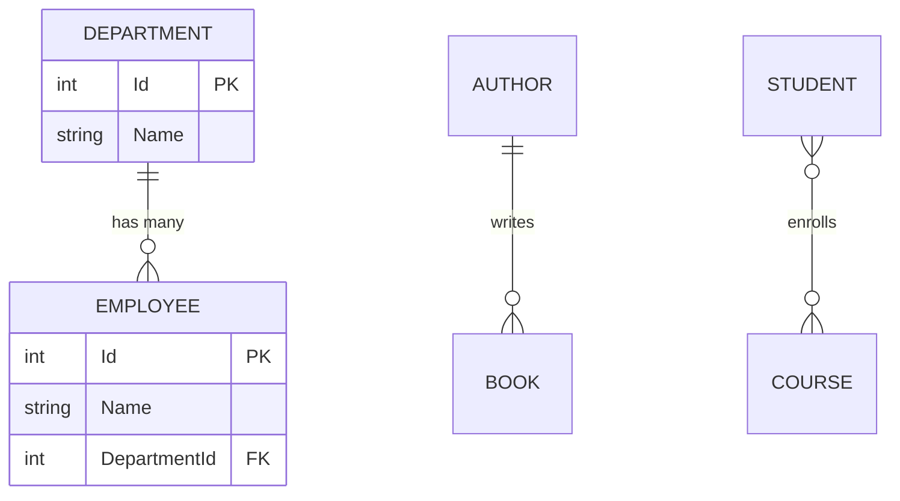
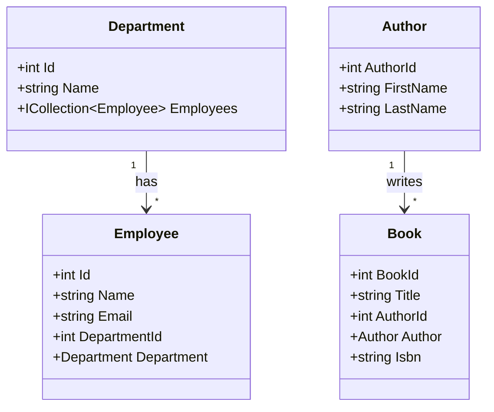

# 📚 Two Table Relationships in Entity Framework Core

> **Complete Guide to Foreign Keys, Navigation Properties, and Eager Loading**

---

## 🎯 Understanding Relationships

Entity Framework Core supports three types of relationships:



| Relationship | Description | Example |
|--------------|-------------|---------|
| **One-to-Many** | One parent has many children | Department → Employees |
| **One-to-One** | One entity linked to exactly one | User → Profile |
| **Many-to-Many** | Both sides have many | Students ↔ Courses |

---

## 📝 One-to-Many Relationship

### Parent Entity (Department)

```csharp
// ════════════════════════════════════════════════════════════════════
// FILE: Models/Department.cs
// PURPOSE: Parent entity in one-to-many relationship
// ════════════════════════════════════════════════════════════════════
namespace API_Two_Table.Models
{
    public class Department
    {
        public int Id { get; set; }
        // Line 1: Primary key
        //         - Convention: "Id" or "DepartmentId"

        public string? Name { get; set; }
        // Line 2: Department name
        
        public ICollection<Employee>? Employees { get; set; }
        // Line 3: Collection navigation property
        //         - ONE Department has MANY Employees
        //         - ICollection<T> for one-to-many collections
        //         - Used for reverse navigation
        //         - Enables: department.Employees.Count()
    }
}
```

### Child Entity (Employee)

```csharp
// ════════════════════════════════════════════════════════════════════
// FILE: Models/Employee.cs
// PURPOSE: Child entity with foreign key
// ════════════════════════════════════════════════════════════════════
using System.ComponentModel;
using System.ComponentModel.DataAnnotations;
using System.Text.Json.Serialization;

namespace API_Two_Table.Models
{
    public class Employee
    {
        public int Id { get; set; }
        // Line 1: Primary key
        
        [Required]
        [DisplayName("Employee Name")]
        public string? Name { get; set; }
        // Line 2: Employee name with validation
        
        [Required]
        [DataType(DataType.EmailAddress)]
        public string? Email { get; set; }
        // Line 3: Email with data type hint
        
        [DisplayName("Department Id")]
        public int DepartmentId { get; set; }
        // Line 4: Foreign key property
        //         - Convention: <NavigationProperty>Id
        //         - Links to Department table
        //         - NOT nullable = required relationship
        //         - int? = optional relationship

        [JsonIgnore]
        // Line 5: Exclude from JSON serialization
        //         - Prevents circular reference
        //         - Employee → Department → Employees → ...
        
        public Department? Department { get; set; }
        // Line 6: Navigation property
        //         - Reference to parent entity
        //         - Populated by Include()
    }
}
```

---

## 📦 Foreign Key with Explicit Attribute

```csharp
// ════════════════════════════════════════════════════════════════════
// FILE: Models/Book.cs
// PURPOSE: Entity with explicit [ForeignKey] attribute
// ════════════════════════════════════════════════════════════════════
using System.ComponentModel.DataAnnotations;
using System.ComponentModel.DataAnnotations.Schema;
using APIAsync.Models;

public class Book
{
    [Key]
    public int BookId { get; set; }
    // Line 1: Explicit primary key

    [MaxLength(25)]
    [MinLength(6, ErrorMessage = "title must be at least 6 characters long")]
    public string? Title { get; set; }

    [ForeignKey("Author")]
    // Line 2: Explicit foreign key attribute
    //         - "Author" = Name of navigation property
    //         - Links AuthorId to Author entity
    //         - Use when naming doesn't follow convention
    
    public int AuthorId { get; set; }
    // Line 3: Foreign key column
    
    public Author? Author { get; set; }
    // Line 4: Navigation property
    //         - Matches [ForeignKey] name

    [Required(ErrorMessage = "ISBN Required")]
    public string? Isbn { get; set; }
}
```

---

## 🔧 Fluent API Configuration

```csharp
// ════════════════════════════════════════════════════════════════════
// FILE: Repository/AppdbContext.cs
// PURPOSE: Configure relationships with Fluent API
// ════════════════════════════════════════════════════════════════════
using APIAsync.Models;
using Microsoft.EntityFrameworkCore;

namespace APIAsync.Repository
{
    public class AppdbContext : DbContext
    {
        public AppdbContext(DbContextOptions<AppdbContext> options) 
            : base(options)
        {
        }
        
        protected override void OnModelCreating(ModelBuilder modelBuilder)
        // Line 1: Override to configure model
        {
            modelBuilder.Entity<Book>()
            // Line 2: Start configuring Book entity
            
                .HasOne<Author>()
                // Line 3: Book has ONE Author
                //         - Navigation property type
                
                .WithMany()
                // Line 4: Author has MANY Books
                //         - No collection property on Author
                //         - Use .WithMany(a => a.Books) if exists
                
                .HasForeignKey(b => b.AuthorId)
                // Line 5: Specify foreign key property
                
                .OnDelete(DeleteBehavior.Cascade);
                // Line 6: Cascade delete behavior
                //         - Delete Author → Delete all Books
                //         - Options: Cascade, Restrict, SetNull, NoAction

            base.OnModelCreating(modelBuilder);
        }

        public DbSet<Book> Books { get; set; }
        public DbSet<Author> Authors { get; set; }
    }
}
```

---

## 📊 Loading Related Data

### Eager Loading (Include)

```csharp
// ════════════════════════════════════════════════════════════════════
// EAGER LOADING - Load related data in same query
// ════════════════════════════════════════════════════════════════════
public IEnumerable<Employee> GetAllEmployee()
{
    return context.Employee
        .Include(emp => emp.Department)
        // Line: Include navigation property
        //       - Generates JOIN in SQL
        //       - Single database query
        //       - Prevents N+1 problem
        .ToList();
}

// Multiple includes
public IEnumerable<Order> GetOrdersWithDetails()
{
    return context.Orders
        .Include(o => o.Customer)         // Include Customer
        .Include(o => o.OrderItems)       // Include Items collection
            .ThenInclude(i => i.Product)  // Then include Product for each item
        .ToList();
}
```

### SQL Generated

```sql
-- With Include()
SELECT e.*, d.*
FROM Employees e
LEFT JOIN Departments d ON e.DepartmentId = d.Id

-- Without Include() - N+1 problem
SELECT * FROM Employees           -- 1 query
SELECT * FROM Departments WHERE Id = 1  -- N queries
SELECT * FROM Departments WHERE Id = 2
-- ... for each employee
```

---

## 🔄 [JsonIgnore] to Prevent Circular References

```csharp
// ════════════════════════════════════════════════════════════════════
// PROBLEM: Circular Reference
// Employee → Department → Employees → Employee...
// ════════════════════════════════════════════════════════════════════

// Solution 1: [JsonIgnore] on navigation property
public class Employee
{
    public int Id { get; set; }
    public string Name { get; set; }
    public int DepartmentId { get; set; }
    
    [JsonIgnore]  // Exclude from serialization
    public Department? Department { get; set; }
}

// Solution 2: Configure in Program.cs
builder.Services.AddControllers().AddJsonOptions(options =>
    options.JsonSerializerOptions.ReferenceHandler = 
    ReferenceHandler.IgnoreCycles);
// Line: Global setting to ignore circular references
```

---

## 📝 Complete Example: Two Table API

### Controller

```csharp
// ════════════════════════════════════════════════════════════════════
// FILE: Controllers/EmployeeController.cs
// PURPOSE: CRUD with related data
// ════════════════════════════════════════════════════════════════════
[Route("api/[controller]")]
[ApiController]
public class EmployeeController : ControllerBase
{
    IEmployeeService employeeService;
    
    public EmployeeController(IEmployeeService employeeService)
    {
        this.employeeService = employeeService;
    }
    
    [HttpGet]
    public IEnumerable<Employee> Get()
    {
        return employeeService.GetAllEmployee();
        // Returns employees WITH departments (eager loaded)
    }
    
    [HttpPost]
    public ActionResult Post([FromBody] Employee emp)
    {
        employeeService.Add(emp);
        return CreatedAtAction("Get", new { id = emp.Id }, emp);
        // DepartmentId is included in emp
        // Department navigation not needed for insert
    }
}
```

### Service with Include

```csharp
// ════════════════════════════════════════════════════════════════════
// FILE: Services/SqlEmployeeService.cs
// PURPOSE: Repository with eager loading
// ════════════════════════════════════════════════════════════════════
public class SqlEmployeeService : IEmployeeService
{
    private readonly AppdbContextRepository context;
    
    public SqlEmployeeService(AppdbContextRepository context)
    {
        this.context = context;
    }
    
    public IEnumerable<Employee> GetAllEmployee()
    {
        return context.Employee
            .Include(dpt => dpt.Department)  // Eager load
            .ToList();
    }
    
    public Employee Add(Employee employee)
    {
        context.Employee.Add(employee);
        // Only DepartmentId needed (foreign key)
        // Department navigation set automatically by EF
        
        context.SaveChanges();
        return employee;
    }
}
```

---

## 📊 Relationship Diagram



---

## 📋 Quick Revision Points

| Concept | Key Point |
|---------|-----------|
| **Foreign Key** | Property linking to parent (e.g., DepartmentId) |
| **Navigation Property** | Reference to related entity |
| **ICollection<T>** | Collection for one-to-many |
| **Include()** | Eager load related data |
| **ThenInclude()** | Include nested relationships |
| **[ForeignKey]** | Explicit FK attribute |
| **[JsonIgnore]** | Prevent circular serialization |

---

## 🎯 Key Takeaways

1. **Foreign Key Property** = `DepartmentId` links to `Department`
2. **Navigation Property** = `Department` property for access
3. **Include()** = Eager load related data (prevents N+1)
4. **[JsonIgnore]** = Prevent circular reference in JSON
5. **Fluent API** = Advanced relationship configuration
6. **Cascade Delete** = Delete parent → delete children

---

## 📚 Interview Questions

**Q1: What is the N+1 problem?**
> Without Include(), EF executes 1 query for main entities, then N queries for each related entity. Include() generates a single JOIN query.

**Q2: How do you configure a foreign key relationship?**
> By convention (DepartmentId for Department), [ForeignKey] attribute, or Fluent API HasForeignKey().

**Q3: What is the difference between Include() and ThenInclude()?**
> Include() loads first-level relationships. ThenInclude() loads nested relationships from the included entity.

**Q4: How do you prevent circular reference in JSON?**
> Use [JsonIgnore] on navigation property, or configure ReferenceHandler.IgnoreCycles in AddJsonOptions().

---

*Next: [13_Model_Validation.md](13_Model_Validation.md) - Data Annotations and Validation*
