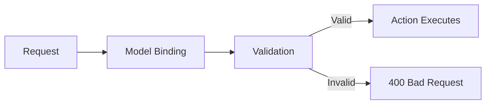
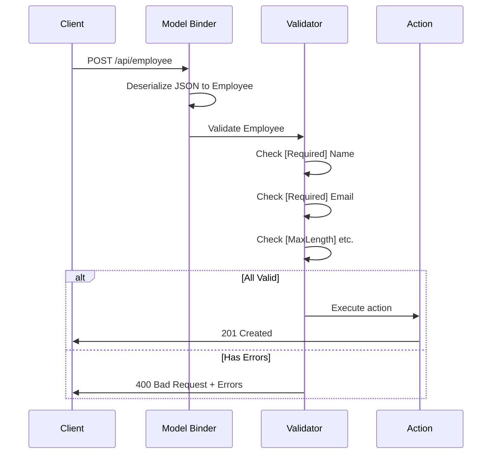

# 📚 Model Validation and Data Annotations

> **Complete Guide to Validating API Input with Attributes**

---

## 🎯 What is Model Validation?

Model validation ensures that data submitted to your API meets specific requirements before processing. ASP.NET Core uses **Data Annotations** (attributes) to define validation rules.



---

## 📝 Common Validation Attributes

| Attribute | Purpose | Example |
|-----------|---------|---------|
| `[Required]` | Field must have value | `[Required]` |
| `[MaxLength(n)]` | Maximum string length | `[MaxLength(100)]` |
| `[MinLength(n)]` | Minimum string length | `[MinLength(3)]` |
| `[StringLength(n)]` | Max length with error | `[StringLength(50)]` |
| `[Range(min,max)]` | Numeric range | `[Range(1, 100)]` |
| `[RegularExpression]` | Regex pattern | `[RegularExpression(@"^\d{5}$")]` |
| `[EmailAddress]` | Email format | `[EmailAddress]` |
| `[Phone]` | Phone format | `[Phone]` |
| `[Compare]` | Compare two properties | `[Compare("Password")]` |
| `[DataType]` | Semantic type | `[DataType(DataType.Date)]` |
| `[Key]` | Primary key | `[Key]` |

---

## 📦 Complete Validated Model

```csharp
// ════════════════════════════════════════════════════════════════════
// FILE: Models/Employee.cs
// PURPOSE: Entity with validation attributes
// ════════════════════════════════════════════════════════════════════
using System.ComponentModel;
using System.ComponentModel.DataAnnotations;
using System.Text.Json.Serialization;

namespace API_Two_Table.Models
{
    public class Employee
    {
        public int Id { get; set; }
        // Line 1: Primary key (auto-increment)
        //         - No validation needed (generated)
        
        [Required]
        // Line 2: [Required]
        //         - Field cannot be null or empty
        //         - Returns 400 if missing
        //         - Default error: "The Name field is required."
        
        [DisplayName("Employee Name")]
        // Line 3: [DisplayName]
        //         - Friendly name for error messages
        //         - "The Employee Name field is required."
        
        public string? Name { get; set; }
        // Line 4: Nullable string (? for nullable reference)
        
        [Required]
        // Line 5: Email is required
        
        [DataType(DataType.EmailAddress)]
        // Line 6: [DataType]
        //         - Semantic type hint
        //         - Affects HTML input type in MVC
        //         - Does NOT validate format!
        //         - Use [EmailAddress] for validation
        
        public string? Email { get; set; }
        
        [DisplayName("Department Id")]
        public int DepartmentId { get; set; }
        // Line 7: Foreign key with display name

        [JsonIgnore]
        public Department? Department { get; set; }
    }
}
```

---

## 📝 Book Model with Detailed Validation

```csharp
// ════════════════════════════════════════════════════════════════════
// FILE: Models/Book.cs
// PURPOSE: Model with length and custom error messages
// ════════════════════════════════════════════════════════════════════
using System.ComponentModel.DataAnnotations;
using System.ComponentModel.DataAnnotations.Schema;
using APIAsync.Models;

public class Book
{
    [Key]
    // Line 1: [Key] - Explicit primary key attribute
    //         - Required when not using Id convention
    
    public int BookId { get; set; }

    [MaxLength(25)]
    // Line 2: [MaxLength(25)]
    //         - Maximum 25 characters
    //         - Database: VARCHAR(25)
    //         - Error: "The field Title must be a string with max length 25."
    
    [MinLength(6, ErrorMessage = "title must be at least 6 characters long")]
    // Line 3: [MinLength(6)]
    //         - Minimum 6 characters
    //         - Custom ErrorMessage overrides default
    
    public string? Title { get; set; }

    [ForeignKey("Author")]
    public int AuthorId { get; set; }
    
    public Author? Author { get; set; }

    [Required(ErrorMessage = "ISBN Required")]
    // Line 4: [Required] with custom message
    //         - "ISBN Required" instead of default
    
    public string? Isbn { get; set; }
}
```

---

## 🔧 Validation Attributes In-Depth

### [Required]

```csharp
[Required]  // Default message
public string Name { get; set; }

[Required(ErrorMessage = "Please enter your name")]  // Custom message
public string Name { get; set; }

[Required(AllowEmptyStrings = false)]  // Reject empty strings
public string Name { get; set; }
```

### [StringLength] and [MaxLength]/[MinLength]

```csharp
[StringLength(100, MinimumLength = 3)]
// Line: Min 3, Max 100 characters
//       Works for string only

[MaxLength(100)]  // Database schema + validation
[MinLength(3)]    // Validation only
public string Title { get; set; }
```

### [Range]

```csharp
[Range(1, 100)]
public int Quantity { get; set; }

[Range(0.01, 10000.00)]
public decimal Price { get; set; }

[Range(typeof(DateTime), "1/1/2000", "12/31/2030")]
public DateTime ReleaseDate { get; set; }
```

### [RegularExpression]

```csharp
[RegularExpression(@"^[A-Z]{2}\d{4}$", ErrorMessage = "Code must be 2 letters + 4 digits")]
public string ProductCode { get; set; }  // AB1234

[RegularExpression(@"^(?=.*[a-z])(?=.*[A-Z])(?=.*\d).{8,}$", 
    ErrorMessage = "Password must be 8+ chars with uppercase, lowercase, and number")]
public string Password { get; set; }
```

### [EmailAddress] and [Phone]

```csharp
[EmailAddress]  // Validates email format
public string Email { get; set; }

[Phone]  // Validates phone format
public string PhoneNumber { get; set; }

// Note: [DataType(DataType.EmailAddress)] does NOT validate!
// Use [EmailAddress] attribute for validation
```

### [Compare]

```csharp
[Required]
public string Password { get; set; }

[Compare("Password", ErrorMessage = "Passwords don't match")]
public string ConfirmPassword { get; set; }
// Line: Compares with Password property
```

---

## 📊 Automatic Validation with [ApiController]

```csharp
// ════════════════════════════════════════════════════════════════════
// WITH [ApiController] - Automatic validation
// ════════════════════════════════════════════════════════════════════
[ApiController]
[Route("api/[controller]")]
public class EmployeeController : ControllerBase
{
    [HttpPost]
    public ActionResult Create([FromBody] Employee emp)
    {
        // No need to check ModelState!
        // [ApiController] returns 400 automatically if invalid
        
        _service.Add(emp);
        return CreatedAtAction("Get", new { id = emp.Id }, emp);
    }
}

// Response for invalid model:
// HTTP 400 Bad Request
// {
//   "type": "https://tools.ietf.org/html/rfc7231#section-6.5.1",
//   "title": "One or more validation errors occurred.",
//   "status": 400,
//   "errors": {
//     "Name": ["The Employee Name field is required."],
//     "Email": ["The Email field is required."]
//   }
// }
```

---

## 🔧 Manual Validation (Without [ApiController])

```csharp
// ════════════════════════════════════════════════════════════════════
// WITHOUT [ApiController] - Manual validation check
// ════════════════════════════════════════════════════════════════════
public class EmployeeController : ControllerBase
{
    [HttpPost]
    public ActionResult Create([FromBody] Employee emp)
    {
        if (!ModelState.IsValid)
        {
            return BadRequest(ModelState);
            // Returns validation errors
        }
        
        _service.Add(emp);
        return Ok(emp);
    }
}
```

---

## 📊 Validation Flow Diagram



---

## 📋 Attribute Summary Table

| Attribute | Applies To | Validation | Database |
|-----------|-----------|------------|----------|
| `[Required]` | Any | ✅ Yes | NOT NULL |
| `[MaxLength(n)]` | String, Array | ✅ Yes | VARCHAR(n) |
| `[MinLength(n)]` | String, Array | ✅ Yes | No effect |
| `[StringLength(n)]` | String | ✅ Yes | VARCHAR(n) |
| `[Range(a,b)]` | Numeric, Date | ✅ Yes | No effect |
| `[EmailAddress]` | String | ✅ Yes | No effect |
| `[Phone]` | String | ✅ Yes | No effect |
| `[Key]` | Any | ❌ No | PRIMARY KEY |
| `[DataType]` | Any | ❌ No* | No effect |
| `[DisplayName]` | Any | ❌ No | No effect |

> *[DataType] provides metadata only, not validation

---

## 📋 Quick Revision Points

| Concept | Key Point |
|---------|-----------|
| `[Required]` | Field cannot be null/empty |
| `[MaxLength]` | Maximum characters + DB schema |
| `[MinLength]` | Minimum characters |
| `[EmailAddress]` | Validates email format |
| `[ApiController]` | Auto 400 for invalid models |
| `ErrorMessage` | Custom validation message |
| `ModelState.IsValid` | Check validity manually |

---

## 🎯 Key Takeaways

1. **[Required]** = Cannot be null or empty
2. **[MaxLength]** = Affects DB + validation
3. **[MinLength]** = Validation only (not DB)
4. **[EmailAddress]** = Validates format
5. **[DataType]** = Metadata only, NOT validation
6. **[ApiController]** = Auto 400 Bad Request
7. **ErrorMessage** = Customize validation messages

---

## 📚 Interview Questions

**Q1: What is the difference between [MaxLength] and [StringLength]?**
> Both set max length for validation and database. [StringLength] can also set MinimumLength in one attribute.

**Q2: Does [DataType(DataType.EmailAddress)] validate email format?**
> No! [DataType] only provides metadata. Use [EmailAddress] attribute for validation.

**Q3: How does [ApiController] affect validation?**
> It enables automatic validation. If model is invalid, returns 400 Bad Request with errors automatically without needing to check ModelState.

**Q4: How do you add custom error messages?**
> Use the ErrorMessage parameter: `[Required(ErrorMessage = "Custom message")]`

---

*Next: [14_Route_Constraints.md](14_Route_Constraints.md) - Route Constraints and URL Validation*
