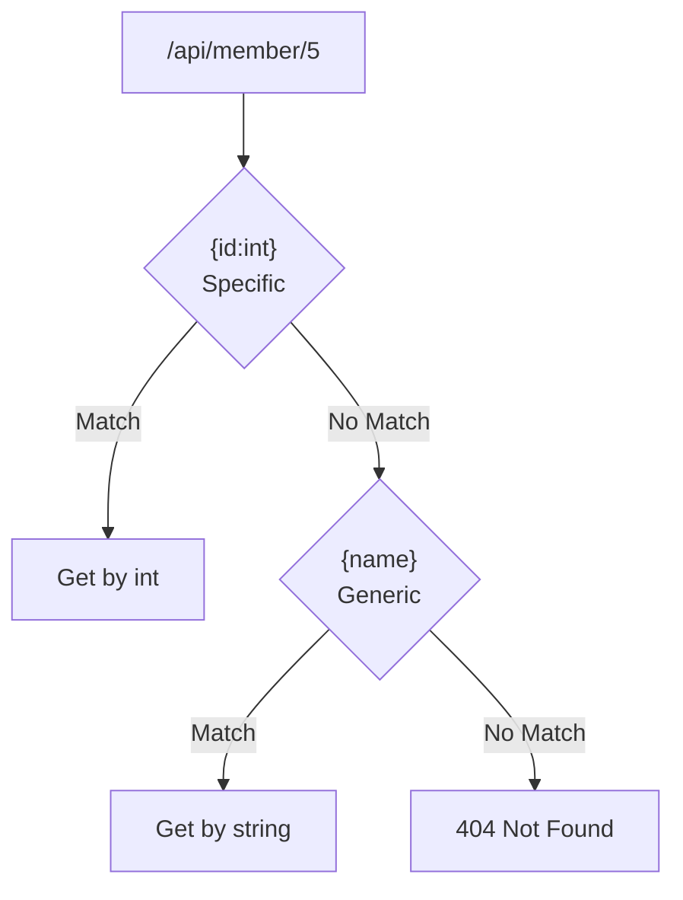

# 📚 Route Constraints in ASP.NET Core Web API

> **Complete Guide to URL Parameter Validation and Route Templates**

---

## 🎯 What are Route Constraints?

Route constraints restrict which URLs match a route template by validating the route parameters.

```mermaid
graph LR
    URL["/api/member/5"] --> RC{Route Constraint<br>{id:int}}
    RC -->|✅ Valid| A[Action Executes]
    RC -->|❌ Invalid| NM[404 Not Found]
    
    URL2["/api/member/abc"] --> RC
```

---

## 📝 Route Constraint Syntax

```csharp
[HttpGet("{id}")]       // No constraint - matches anything
[HttpGet("{id:int}")]   // Integer constraint
[HttpGet("{id:int:min(1)}")]  // Integer with minimum value
```

---

## 🔧 Complete Constraint Reference

### Type Constraints

| Constraint | Description | Example | Matches | Doesn't Match |
|------------|-------------|---------|---------|---------------|
| `int` | Integer | `{id:int}` | 5, 100 | abc, 1.5 |
| `long` | Long integer | `{id:long}` | 12345678901 | abc |
| `float` | Floating point | `{price:float}` | 3.14 | abc |
| `double` | Double | `{rating:double}` | 3.14159 | abc |
| `decimal` | Decimal | `{price:decimal}` | 99.99 | abc |
| `bool` | Boolean | `{active:bool}` | true, false | yes, 1 |
| `datetime` | DateTime | `{date:datetime}` | 2024-01-15 | abc |
| `guid` | GUID | `{id:guid}` | CD2C... | abc |

### String Constraints

| Constraint | Description | Example | Matches | Doesn't Match |
|------------|-------------|---------|---------|---------------|
| `alpha` | Alphabetic only | `{name:alpha}` | John | John123 |
| `length(n)` | Exact length | `{code:length(6)}` | ABCDEF | ABC |
| `length(m,n)` | Length range | `{code:length(4,8)}` | ABCDEF | AB |
| `minlength(n)` | Minimum length | `{name:minlength(3)}` | John | Jo |
| `maxlength(n)` | Maximum length | `{name:maxlength(10)}` | John | VeryLongName |

### Numeric Constraints

| Constraint | Description | Example | Matches | Doesn't Match |
|------------|-------------|---------|---------|---------------|
| `min(n)` | Minimum value | `{age:min(18)}` | 18, 21 | 17 |
| `max(n)` | Maximum value | `{age:max(120)}` | 50, 100 | 150 |
| `range(m,n)` | Value range | `{age:range(18,65)}` | 25 | 10, 70 |

### Pattern Constraints

| Constraint | Description | Example |
|------------|-------------|---------|
| `regex(expr)` | Regex pattern | `{code:regex(^[A-Z]{{2}}\\d{{4}}$)}` |

---

## 📝 Examples from Source Code

### Integer Constraint

```csharp
// ════════════════════════════════════════════════════════════════════
// FROM: MemberController.cs
// PURPOSE: Route with integer constraint
// ════════════════════════════════════════════════════════════════════
[HttpGet("{id:int}")]
// Line: {id:int} = Only match integer values
//       - /api/member/5 → ✅ matches, id = 5
//       - /api/member/abc → ❌ 404 Not Found
//       - /api/member/3.14 → ❌ 404 Not Found

public Members Get(int id)
{
    return member.GetMember(id);
}
```

### Multiple Route Parameters

```csharp
// ════════════════════════════════════════════════════════════════════
// Multiple routes on same action
// ════════════════════════════════════════════════════════════════════
[HttpGet("{id:int}")]
// Line: Matches /api/member/5
public Members Get(int id)
{
    return member.GetMember(id);
}

[HttpGet("{name}")]
// Line: Matches /api/member/John (string, no constraint)
public IEnumerable<Members> Get(string name)
{
    return member.GetAllMemberbyname(name);
}

// Route precedence:
// 1. {id:int} - more specific (has constraint)
// 2. {name} - less specific (matches anything)
// /api/member/5 → matches {id:int}
// /api/member/John → matches {name}
```

### Named Route Segment

```csharp
// ════════════════════════════════════════════════════════════════════
// Literal segment in route
// ════════════════════════════════════════════════════════════════════
[HttpGet("Address/{address}")]
// Line: "Address" is literal, {address} is parameter
//       - /api/member/Address/Mumbai → ✅ matches
//       - /api/member/Mumbai → ❌ doesn't match

public IEnumerable<Members> GetAddress(string address)
{
    return member.GetAllMemberbyaddress(address);
}
```

---

## 🔧 Combined Constraints

```csharp
// ════════════════════════════════════════════════════════════════════
// Multiple constraints on one parameter
// ════════════════════════════════════════════════════════════════════
[HttpGet("{id:int:min(1):max(1000)}")]
// Line: Must be integer between 1 and 1000
//       - /api/member/5 → ✅ matches
//       - /api/member/0 → ❌ 404 (less than min)
//       - /api/member/1001 → ❌ 404 (greater than max)

public Member Get(int id)
{
    return _service.GetById(id);
}

[HttpGet("{name:alpha:minlength(2):maxlength(50)}")]
// Line: Alphabetic only, 2-50 characters
//       - /api/member/Jo → ✅ matches (2 chars, alpha)
//       - /api/member/A → ❌ 404 (too short)
//       - /api/member/Jo123 → ❌ 404 (not alpha)

public IEnumerable<Member> Search(string name)
{
    return _service.SearchByName(name);
}
```

---

## 📊 Regex Constraints

```csharp
// ════════════════════════════════════════════════════════════════════
// Regex pattern constraint
// ════════════════════════════════════════════════════════════════════
[HttpGet("{code:regex(^[A-Z]{{2}}\\d{{4}}$)}")]
// Line: Pattern = 2 uppercase letters + 4 digits
//       - Note: {{ }} escapes { } in C# strings
//       - /api/product/AB1234 → ✅ matches
//       - /api/product/ABC123 → ❌ 404

public Product Get(string code)
{
    return _service.GetByCode(code);
}

[HttpGet("{zipcode:regex(^\\d{{5}}(-\\d{{4}})?$)}")]
// Line: US zip code pattern (12345 or 12345-6789)

public Location GetByZip(string zipcode)
{
    return _service.GetLocation(zipcode);
}
```

---

## 📊 Route Matching Order



**Route Precedence Rules:**
1. More segments → higher priority
2. Literal segments → higher than parameters
3. Constrained parameters → higher than unconstrained
4. Catch-all → lowest priority

---

## 🔧 Optional and Default Values

```csharp
// ════════════════════════════════════════════════════════════════════
// Optional and default parameters
// ════════════════════════════════════════════════════════════════════

// Optional parameter (?)
[HttpGet("{id:int?}")]
// Line: id is optional
//       - /api/member → matches, id = null/default
//       - /api/member/5 → matches, id = 5

// Default value (=)
[HttpGet("{page:int=1}")]
// Line: page defaults to 1 if not provided
//       - /api/member → matches, page = 1
//       - /api/member/2 → matches, page = 2

// Combining with constraints
[HttpGet("{id:int:min(1)?}")]
// Line: Optional but must be >= 1 if provided
```

---

## 📋 Route Constraint Summary

| Category | Constraints |
|----------|-------------|
| **Type** | int, long, float, double, decimal, bool, datetime, guid |
| **Length** | length(n), length(m,n), minlength(n), maxlength(n) |
| **Range** | min(n), max(n), range(m,n) |
| **Character** | alpha |
| **Pattern** | regex(expression) |
| **Optional** | ? (e.g., {id:int?}) |
| **Default** | = (e.g., {id:int=1}) |

---

## 📋 Quick Revision Points

| Concept | Key Point |
|---------|-----------|
| `{id:int}` | Only match integers |
| `{id:int:min(1)}` | Integer >= 1 |
| `{name:alpha}` | Alphabetic only |
| `{code:length(6)}` | Exact 6 characters |
| `{id:int?}` | Optional parameter |
| `{page:int=1}` | Default value |
| Route precedence | Specific before generic |

---

## 🎯 Key Takeaways

1. **Constraints** = Validate URL parameters
2. **Type constraints** = int, bool, guid, etc.
3. **Multiple constraints** = Chain with colons
4. **Specific wins** = More constrained routes match first
5. **Regex** = Use {{}} to escape braces
6. **Optional** = Add ? suffix
7. **Defaults** = Add =value

---

## 📚 Interview Questions

**Q1: What happens when a route constraint fails?**
> The route doesn't match, and ASP.NET tries other routes. If no route matches, returns 404 Not Found.

**Q2: How do you combine multiple constraints?**
> Chain them with colons: `{id:int:min(1):max(100)}`

**Q3: What is route precedence?**
> More specific routes (more segments, literal text, constraints) are matched before less specific ones.

**Q4: How do you use regex in route constraints?**
> Use double braces to escape: `{code:regex(^[A-Z]{{2}}\\d{{4}}$)}`

---

*Next: [15_JWT_Authentication.md](15_JWT_Authentication.md) - JWT Token Authentication*
