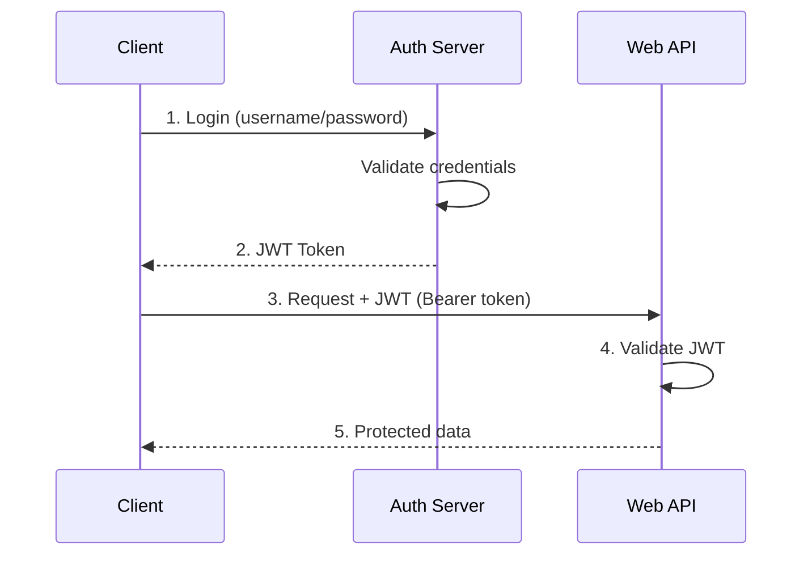
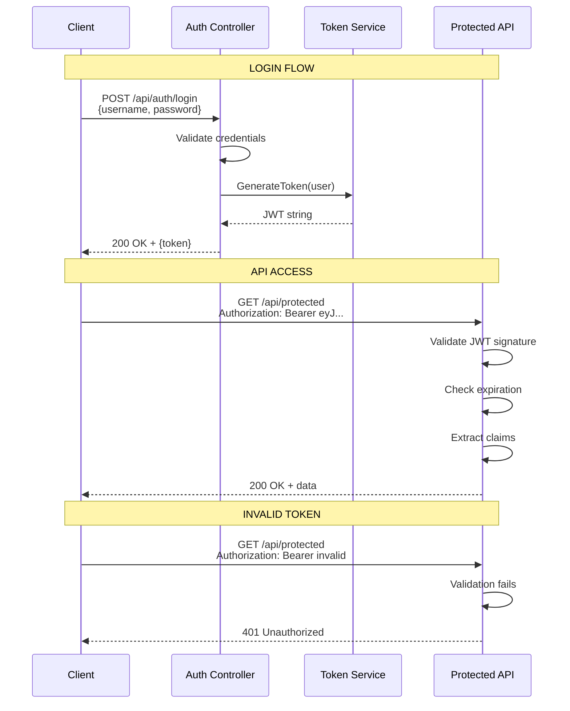

# 📚 JWT Authentication in ASP.NET Core Web API

> **Complete Guide to Token-Based Authentication with JSON Web Tokens**

---

## 🎯 What is JWT?

**JWT (JSON Web Token)** is a compact, URL-safe token format for securely transmitting information between parties. It's commonly used for authentication in Web APIs.



---

## 📦 JWT Structure

A JWT consists of three parts separated by dots:

```
xxxxx.yyyyy.zzzzz
Header.Payload.Signature
```

### Visual Breakdown

```
eyJhbGciOiJIUzI1NiIsInR5cCI6IkpXVCJ9.    ← Header (Base64)
eyJzdWIiOiIxMjM0NTY3ODkwIiwibmFtZSI6Ikp    ← Payload (Base64)
vYW4iLCJpYXQiOjE1MTYyMzkwMjJ9.
SflKxwRJSMeKKF2QT4fwpMeJf36POk6yJV_adQs    ← Signature
sRw
```

### JWT Parts

| Part | Content | Encoded |
|------|---------|---------|
| **Header** | Algorithm & token type | `{"alg":"HS256","typ":"JWT"}` |
| **Payload** | Claims (user data) | `{"sub":"123","name":"John"}` |
| **Signature** | Verification hash | HMACSHA256(header.payload, secret) |

---

## 🔧 Setting Up JWT Authentication

### Step 1: Install NuGet Package

```bash
dotnet add package Microsoft.AspNetCore.Authentication.JwtBearer
```

### Step 2: Configure in Program.cs

```csharp
// ════════════════════════════════════════════════════════════════════
// FILE: Program.cs
// PURPOSE: Configure JWT authentication
// ════════════════════════════════════════════════════════════════════
using Microsoft.AspNetCore.Authentication.JwtBearer;
using Microsoft.IdentityModel.Tokens;
using System.Text;

var builder = WebApplication.CreateBuilder(args);

// Add controllers
builder.Services.AddControllers();

// ══════════════════════════════════════════════════════════════════
// JWT CONFIGURATION
// ══════════════════════════════════════════════════════════════════
builder.Services.AddAuthentication(options =>
{
    options.DefaultAuthenticateScheme = JwtBearerDefaults.AuthenticationScheme;
    // Line 1: Default scheme for authentication
    
    options.DefaultChallengeScheme = JwtBearerDefaults.AuthenticationScheme;
    // Line 2: Default scheme for challenges (401)
})
.AddJwtBearer(options =>
{
    options.TokenValidationParameters = new TokenValidationParameters
    {
        ValidateIssuer = true,
        // Line 3: Validate token issuer
        
        ValidateAudience = true,
        // Line 4: Validate token audience
        
        ValidateLifetime = true,
        // Line 5: Check token expiration
        
        ValidateIssuerSigningKey = true,
        // Line 6: Validate signature
        
        ValidIssuer = builder.Configuration["Jwt:Issuer"],
        // Line 7: Expected issuer value
        
        ValidAudience = builder.Configuration["Jwt:Audience"],
        // Line 8: Expected audience value
        
        IssuerSigningKey = new SymmetricSecurityKey(
            Encoding.UTF8.GetBytes(builder.Configuration["Jwt:Key"]!))
        // Line 9: Secret key for signature validation
    };
});

// ... other services

var app = builder.Build();

// ══════════════════════════════════════════════════════════════════
// MIDDLEWARE ORDER IS IMPORTANT!
// ══════════════════════════════════════════════════════════════════
app.UseAuthentication();  // Must come before UseAuthorization
// Line: Authenticate the request (validate JWT)

app.UseAuthorization();
// Line: Authorize the request (check [Authorize])

app.MapControllers();
app.Run();
```

### Step 3: Configuration (appsettings.json)

```json
{
  "Jwt": {
    "Key": "YourSuperSecretKeyThatShouldBeAtLeast32BytesLong!",
    "Issuer": "https://yourcompany.com",
    "Audience": "https://yourapi.com"
  }
}
```

---

## 📝 Generating JWT Tokens

### Token Generation Service

```csharp
// ════════════════════════════════════════════════════════════════════
// FILE: Services/TokenService.cs
// PURPOSE: Generate JWT tokens
// ════════════════════════════════════════════════════════════════════
using Microsoft.IdentityModel.Tokens;
using System.IdentityModel.Tokens.Jwt;
using System.Security.Claims;
using System.Text;

public class TokenService : ITokenService
{
    private readonly IConfiguration _config;
    
    public TokenService(IConfiguration config)
    {
        _config = config;
    }
    
    public string GenerateToken(User user)
    {
        var securityKey = new SymmetricSecurityKey(
            Encoding.UTF8.GetBytes(_config["Jwt:Key"]!));
        // Line 1: Create security key from secret
        
        var credentials = new SigningCredentials(
            securityKey, SecurityAlgorithms.HmacSha256);
        // Line 2: Create signing credentials
        //         - HmacSha256 = Symmetric algorithm
        
        var claims = new[]
        {
            new Claim(ClaimTypes.NameIdentifier, user.Id.ToString()),
            // Line 3: User ID claim
            
            new Claim(ClaimTypes.Name, user.Username),
            // Line 4: Username claim
            
            new Claim(ClaimTypes.Email, user.Email),
            // Line 5: Email claim
            
            new Claim(ClaimTypes.Role, user.Role),
            // Line 6: Role claim for authorization
            
            new Claim("custom", "value")
            // Line 7: Custom claims
        };
        
        var token = new JwtSecurityToken(
            issuer: _config["Jwt:Issuer"],
            // Line 8: Token issuer
            
            audience: _config["Jwt:Audience"],
            // Line 9: Token audience
            
            claims: claims,
            // Line 10: User claims
            
            expires: DateTime.Now.AddHours(1),
            // Line 11: Token expiration
            
            signingCredentials: credentials
            // Line 12: Signature credentials
        );
        
        return new JwtSecurityTokenHandler().WriteToken(token);
        // Line 13: Serialize token to string
    }
}
```

---

## 🔐 Protecting Endpoints

### [Authorize] Attribute

```csharp
// ════════════════════════════════════════════════════════════════════
// FILE: Controllers/ProtectedController.cs
// PURPOSE: Protected API endpoints
// ════════════════════════════════════════════════════════════════════
[ApiController]
[Route("api/[controller]")]
[Authorize]  // Entire controller requires authentication
public class ProtectedController : ControllerBase
{
    [HttpGet]
    public IActionResult Get()
    {
        // Access user claims
        var userId = User.FindFirst(ClaimTypes.NameIdentifier)?.Value;
        var username = User.Identity?.Name;
        
        return Ok(new { userId, username, message = "You are authenticated!" });
    }
    
    [HttpGet("admin")]
    [Authorize(Roles = "Admin")]
    // Line: Only users with Admin role
    public IActionResult AdminOnly()
    {
        return Ok("Welcome, Admin!");
    }
    
    [HttpGet("public")]
    [AllowAnonymous]
    // Line: Override - allow unauthenticated access
    public IActionResult Public()
    {
        return Ok("This is public");
    }
}
```

---

## 📊 Authentication Flow Diagram



---

## 🔧 Login Controller

```csharp
// ════════════════════════════════════════════════════════════════════
// FILE: Controllers/AuthController.cs
// PURPOSE: Authentication endpoints
// ════════════════════════════════════════════════════════════════════
[ApiController]
[Route("api/[controller]")]
public class AuthController : ControllerBase
{
    private readonly ITokenService _tokenService;
    private readonly IUserService _userService;
    
    public AuthController(ITokenService tokenService, IUserService userService)
    {
        _tokenService = tokenService;
        _userService = userService;
    }
    
    [HttpPost("login")]
    public IActionResult Login([FromBody] LoginRequest request)
    {
        // Validate user credentials
        var user = _userService.ValidateCredentials(
            request.Username, request.Password);
        
        if (user == null)
            return Unauthorized("Invalid credentials");
        
        // Generate JWT
        var token = _tokenService.GenerateToken(user);
        
        return Ok(new { token });
    }
}

public class LoginRequest
{
    public string Username { get; set; }
    public string Password { get; set; }
}
```

---

## 📋 Common JWT Claims

| Claim Type | Description | Example |
|------------|-------------|---------|
| `sub` | Subject (user ID) | "123" |
| `name` | Username | "john_doe" |
| `email` | User email | "john@example.com" |
| `role` | User role | "Admin" |
| `iat` | Issued at | Unix timestamp |
| `exp` | Expiration | Unix timestamp |
| `iss` | Issuer | "https://myapp.com" |
| `aud` | Audience | "https://myapi.com" |

---

## 📋 Quick Revision Points

| Concept | Key Point |
|---------|-----------|
| **JWT** | Token = Header.Payload.Signature |
| **Bearer** | Token type in Authorization header |
| **[Authorize]** | Requires authentication |
| **[AllowAnonymous]** | Allows unauthenticated access |
| **Claims** | User data embedded in token |
| **Middleware order** | Authentication before Authorization |

---

## 🎯 Key Takeaways

1. **JWT** = Compact, self-contained token
2. **Three parts** = Header.Payload.Signature
3. **Bearer token** = `Authorization: Bearer <token>`
4. **UseAuthentication** = Before UseAuthorization
5. **[Authorize]** = Protect endpoints
6. **Claims** = User data in token

---

## 📚 Interview Questions

**Q1: What are the three parts of a JWT?**
> Header (algorithm, type), Payload (claims/data), Signature (verification hash).

**Q2: How does JWT validation work?**
> The server recalculates the signature using the header, payload, and secret key. If it matches the provided signature, the token is valid.

**Q3: What is the purpose of the [Authorize] attribute?**
> It restricts access to the endpoint. Only authenticated users (with valid JWT) can access it.

**Q4: Why is middleware order important for authentication?**
> UseAuthentication must come before UseAuthorization. Authentication identifies the user, authorization checks their permissions.

---

*Next: [16_Microservices_Basics.md](16_Microservices_Basics.md) - Introduction to Microservices Architecture*
