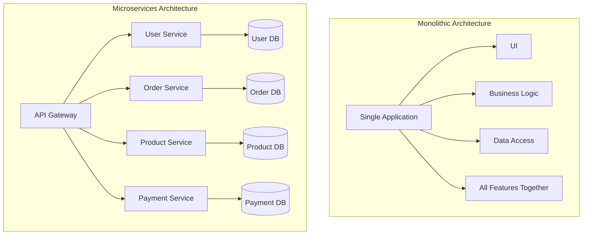
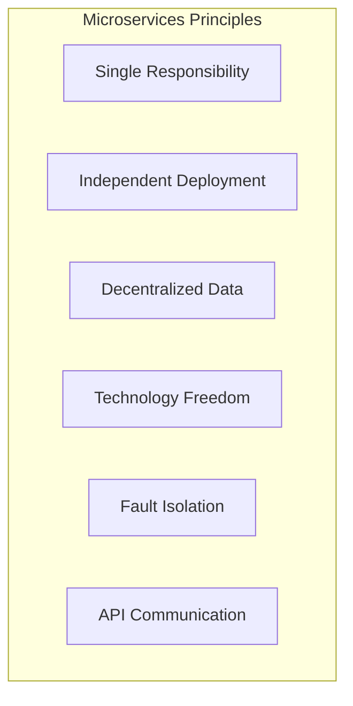
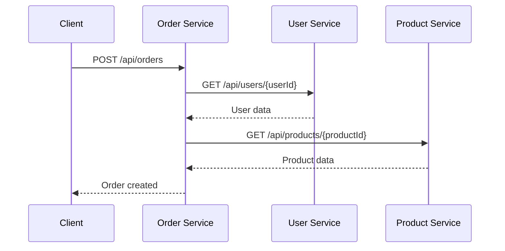
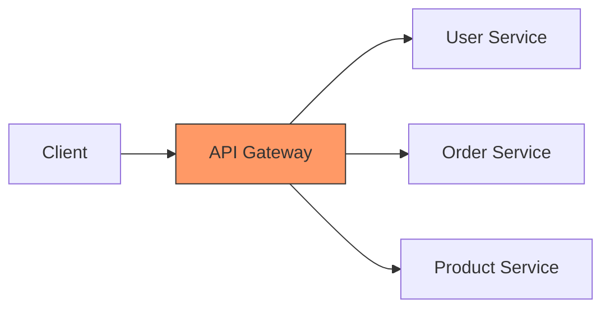
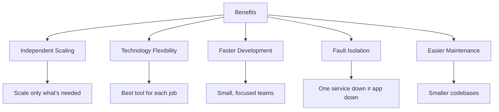

# 📚 Microservices Basics

> **Complete Guide to Microservices Architecture and Web API's Role**

---

## 🎯 What are Microservices?

**Microservices** is an architectural style where an application is built as a collection of small, independent services that communicate over a network.



---

## 🔄 Monolithic vs Microservices

| Aspect | Monolithic | Microservices |
|--------|------------|---------------|
| **Deployment** | Single unit | Independent services |
| **Scaling** | Scale entire app | Scale individual services |
| **Technology** | Single stack | Different tech per service |
| **Failure Impact** | Entire app down | Only one service affected |
| **Team Structure** | Large teams | Small, focused teams |
| **Development** | Tightly coupled | Loosely coupled |
| **Database** | Shared database | Database per service |
| **Complexity** | Lower initially | Higher but scalable |

---

## 🏗️ Key Characteristics



### 1. Single Responsibility

Each service does ONE thing well:

```
┌─────────────────┐
│  User Service   │  → Handles users, authentication
├─────────────────┤
│  Order Service  │  → Handles orders, cart
├─────────────────┤
│  Product Service│  → Handles catalog, inventory
├─────────────────┤
│ Payment Service │  → Handles payments, refunds
└─────────────────┘
```

### 2. Independent Deployment

- Deploy User Service without touching Order Service
- Different release cycles
- Faster time to market

### 3. Decentralized Data

Each service owns its data:

```
User Service → User Database (PostgreSQL)
Order Service → Order Database (MongoDB)
Product Service → Product Database (SQL Server)
```

---

## 🔧 Web API's Role in Microservices

ASP.NET Core Web API is the primary technology for building microservices:

```csharp
// ════════════════════════════════════════════════════════════════════
// Each microservice is a separate Web API project
// ════════════════════════════════════════════════════════════════════

// USER SERVICE (Port 5001)
[Route("api/[controller]")]
[ApiController]
public class UserController : ControllerBase
{
    [HttpGet("{id}")]
    public User GetUser(int id) => _userService.Get(id);
    
    [HttpPost("login")]
    public IActionResult Login(LoginRequest request) => ...
}

// ORDER SERVICE (Port 5002)
[Route("api/[controller]")]
[ApiController]
public class OrderController : ControllerBase
{
    [HttpGet("{id}")]
    public Order GetOrder(int id) => _orderService.Get(id);
    
    [HttpPost]
    public Order CreateOrder(OrderRequest request) => ...
}

// PRODUCT SERVICE (Port 5003)
[Route("api/[controller]")]
[ApiController]
public class ProductController : ControllerBase
{
    [HttpGet]
    public IEnumerable<Product> GetProducts() => _productService.GetAll();
    
    [HttpGet("{id}")]
    public Product GetProduct(int id) => _productService.Get(id);
}
```

---

## 📊 Service Communication

### Synchronous (HTTP)



### Service-to-Service Calls

```csharp
// Order Service calling User Service
public class OrderService
{
    private readonly HttpClient _httpClient;
    
    public async Task<User> GetUserAsync(int userId)
    {
        var response = await _httpClient.GetAsync(
            $"http://user-service/api/users/{userId}");
        
        return await response.Content.ReadFromJsonAsync<User>();
    }
}
```

---

## 🔧 API Gateway Pattern



**Gateway Responsibilities:**
- Single entry point
- Request routing
- Authentication/Authorization
- Rate limiting
- Load balancing
- Response aggregation

---

## 📦 Microservices Benefits



---

## ⚠️ Microservices Challenges

| Challenge | Description | Solution |
|-----------|-------------|----------|
| **Complexity** | Many moving parts | Service mesh, monitoring |
| **Data Consistency** | Distributed transactions | Event sourcing, Saga pattern |
| **Network Latency** | Inter-service calls | Caching, async communication |
| **Testing** | Integration testing hard | Contract testing |
| **Debugging** | Distributed tracing | Centralized logging |
| **DevOps** | Many deployments | CI/CD pipelines |

---

## 📋 Quick Revision Points

| Concept | Key Point |
|---------|-----------|
| **Microservices** | Small, independent services |
| **Single Responsibility** | One service, one purpose |
| **Independent Deployment** | Deploy without affecting others |
| **Decentralized Data** | Each service owns its data |
| **API Communication** | Services talk via HTTP/REST |
| **API Gateway** | Single entry point |

---

## 🎯 Key Takeaways

1. **Microservices** = Small, focused services
2. **Web API** = Primary communication mechanism
3. **Independence** = Deploy, scale, develop separately
4. **Own your data** = Each service has its database
5. **Trade-offs** = Complexity vs. scalability

---

## 📚 Interview Questions

**Q1: What is the difference between monolithic and microservices?**
> Monolithic is a single deployable unit with all features together. Microservices breaks the application into small, independent services.

**Q2: How do microservices communicate?**
> Typically via HTTP/REST APIs (synchronous) or message queues (asynchronous).

**Q3: What is an API Gateway?**
> A single entry point that routes requests to appropriate services, handles authentication, and can aggregate responses.

**Q4: What is the main challenge with microservices?**
> Managing distributed complexity: inter-service communication, data consistency, debugging, and deployment.

---

*Next: [17_Global_Exception_Middleware.md](17_Global_Exception_Middleware.md) - Global Exception Handling*
