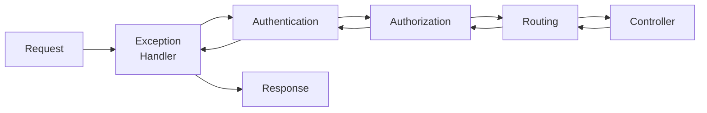
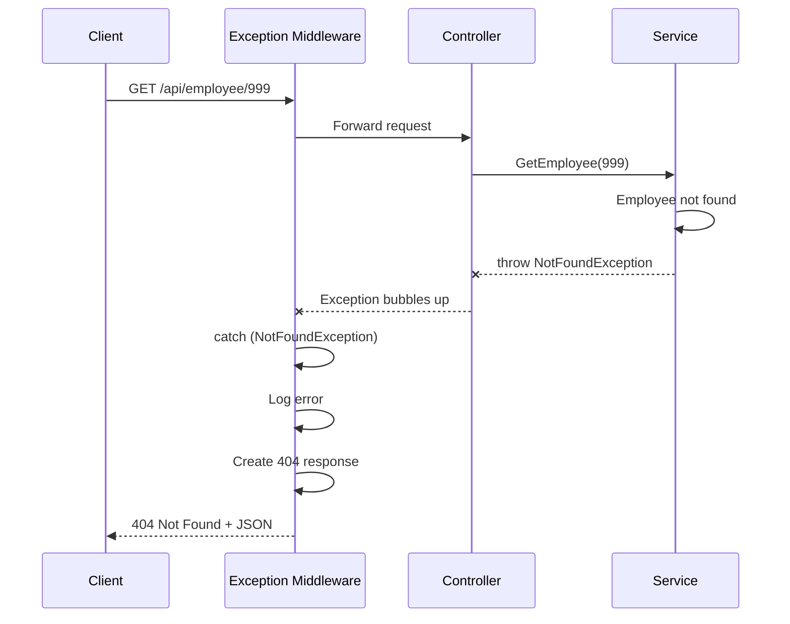

# 📚 Global Exception Handling and Middleware

> **Complete Guide to Centralized Error Handling in ASP.NET Core Web API**

---

## 🎯 What is Middleware?

**Middleware** is software that handles HTTP requests and responses in a pipeline. Each middleware component can process the request, pass it to the next component, or short-circuit the pipeline.



---

## 📦 Middleware Pipeline

```csharp
// ════════════════════════════════════════════════════════════════════
// FILE: Program.cs
// PURPOSE: Configure middleware pipeline
// ════════════════════════════════════════════════════════════════════
var app = builder.Build();

// Middleware order matters!
app.UseExceptionHandler("/error");  // 1. Handle exceptions FIRST
app.UseHsts();                       // 2. Security headers
app.UseHttpsRedirection();           // 3. HTTPS redirect
app.UseStaticFiles();                // 4. Static files
app.UseRouting();                    // 5. Route matching
app.UseCors();                       // 6. CORS policy
app.UseAuthentication();             // 7. Who are you?
app.UseAuthorization();              // 8. What can you do?
app.MapControllers();                // 9. Execute controller

app.Run();
```

---

## 🔧 Built-in Exception Handler

### Simple Error Handling

```csharp
// ════════════════════════════════════════════════════════════════════
// Basic exception handling with UseExceptionHandler
// ════════════════════════════════════════════════════════════════════
if (app.Environment.IsDevelopment())
{
    app.UseDeveloperExceptionPage();
    // Line: Shows detailed error info (stack trace, etc.)
    //       ONLY use in development!
}
else
{
    app.UseExceptionHandler("/error");
    // Line: Redirects to /error endpoint in production
    //       Hides sensitive error details
}
```

### Error Controller

```csharp
// ════════════════════════════════════════════════════════════════════
// FILE: Controllers/ErrorController.cs
// PURPOSE: Handle errors with standard response
// ════════════════════════════════════════════════════════════════════
[ApiController]
[Route("[controller]")]
public class ErrorController : ControllerBase
{
    [Route("/error")]
    [ApiExplorerSettings(IgnoreApi = true)]  // Hide from Swagger
    public IActionResult HandleError()
    {
        var context = HttpContext.Features.Get<IExceptionHandlerFeature>();
        var exception = context?.Error;
        
        return Problem(
            title: "An error occurred",
            detail: exception?.Message,
            statusCode: 500
        );
    }
    
    [Route("/error-development")]
    [ApiExplorerSettings(IgnoreApi = true)]
    public IActionResult HandleErrorDevelopment()
    {
        var context = HttpContext.Features.Get<IExceptionHandlerFeature>();
        var exception = context?.Error;

        return Problem(
            title: exception?.GetType().Name,
            detail: exception?.StackTrace,
            statusCode: 500
        );
    }
}
```

---

## 📝 Custom Exception Middleware

```csharp
// ════════════════════════════════════════════════════════════════════
// FILE: Middleware/GlobalExceptionMiddleware.cs
// PURPOSE: Custom global exception handler
// ════════════════════════════════════════════════════════════════════
using System.Net;
using System.Text.Json;

public class GlobalExceptionMiddleware
{
    private readonly RequestDelegate _next;
    private readonly ILogger<GlobalExceptionMiddleware> _logger;

    public GlobalExceptionMiddleware(
        RequestDelegate next, 
        ILogger<GlobalExceptionMiddleware> logger)
    {
        _next = next;
        // Line: Next middleware in pipeline
        
        _logger = logger;
        // Line: Logger for exception logging
    }

    public async Task InvokeAsync(HttpContext context)
    {
        try
        {
            await _next(context);
            // Line: Call next middleware
            //       If no exception, continues normally
        }
        catch (Exception ex)
        {
            _logger.LogError(ex, "An unhandled exception occurred");
            // Line: Log the exception
            
            await HandleExceptionAsync(context, ex);
            // Line: Send error response
        }
    }

    private static async Task HandleExceptionAsync(HttpContext context, Exception exception)
    {
        context.Response.ContentType = "application/json";
        // Line: Set response content type
        
        var response = new ErrorResponse();
        
        switch (exception)
        {
            case NotFoundException ex:
                // Line: Custom not found exception
                context.Response.StatusCode = (int)HttpStatusCode.NotFound;
                response.Message = ex.Message;
                break;
                
            case ValidationException ex:
                // Line: Custom validation exception
                context.Response.StatusCode = (int)HttpStatusCode.BadRequest;
                response.Message = ex.Message;
                response.Errors = ex.Errors;
                break;
                
            case UnauthorizedException ex:
                // Line: Custom unauthorized exception
                context.Response.StatusCode = (int)HttpStatusCode.Unauthorized;
                response.Message = "Unauthorized";
                break;
                
            default:
                // Line: All other exceptions
                context.Response.StatusCode = (int)HttpStatusCode.InternalServerError;
                response.Message = "An error occurred. Please try again later.";
                break;
        }
        
        var json = JsonSerializer.Serialize(response);
        await context.Response.WriteAsync(json);
    }
}

// Error response model
public class ErrorResponse
{
    public string Message { get; set; }
    public Dictionary<string, string[]>? Errors { get; set; }
    public string TraceId { get; set; }
}
```

---

## 🔧 Registering Custom Middleware

```csharp
// ════════════════════════════════════════════════════════════════════
// FILE: Program.cs
// PURPOSE: Register custom middleware
// ════════════════════════════════════════════════════════════════════

// Method 1: Extension method
public static class MiddlewareExtensions
{
    public static IApplicationBuilder UseGlobalExceptionHandler(
        this IApplicationBuilder app)
    {
        return app.UseMiddleware<GlobalExceptionMiddleware>();
    }
}

// In Program.cs
app.UseGlobalExceptionHandler();  // Must be FIRST in pipeline
app.UseAuthentication();
app.UseAuthorization();
app.MapControllers();

// Method 2: Direct registration
app.UseMiddleware<GlobalExceptionMiddleware>();
```

---

## 📝 Custom Exceptions

```csharp
// ════════════════════════════════════════════════════════════════════
// FILE: Exceptions/CustomExceptions.cs
// PURPOSE: Custom exception types
// ════════════════════════════════════════════════════════════════════

public class NotFoundException : Exception
{
    public NotFoundException(string message) : base(message) { }
    
    public NotFoundException(string name, object key)
        : base($"{name} with key ({key}) was not found.") { }
}

public class ValidationException : Exception
{
    public Dictionary<string, string[]> Errors { get; }
    
    public ValidationException(Dictionary<string, string[]> errors)
        : base("One or more validation errors occurred.")
    {
        Errors = errors;
    }
}

public class UnauthorizedException : Exception
{
    public UnauthorizedException() : base("Unauthorized access.") { }
}
```

### Using Custom Exceptions

```csharp
// ════════════════════════════════════════════════════════════════════
// In your service/controller
// ════════════════════════════════════════════════════════════════════
public Employee GetEmployee(int id)
{
    var employee = _context.Employees.Find(id);
    
    if (employee == null)
        throw new NotFoundException(nameof(Employee), id);
    
    return employee;
}
// Middleware catches exception and returns 404 with message
```

---

## 📊 Exception Flow Diagram



---

## 📋 Response Examples

### 404 Not Found

```json
{
  "message": "Employee with key (999) was not found.",
  "traceId": "00-abc123..."
}
```

### 400 Validation Error

```json
{
  "message": "One or more validation errors occurred.",
  "errors": {
    "Name": ["The Name field is required."],
    "Email": ["Invalid email format."]
  }
}
```

### 500 Internal Server Error

```json
{
  "message": "An error occurred. Please try again later.",
  "traceId": "00-xyz789..."
}
```

---

## 📋 Quick Revision Points

| Concept | Key Point |
|---------|-----------|
| **Middleware** | Components in request pipeline |
| **Order matters** | Exception handler FIRST |
| **Custom middleware** | Inherit RequestDelegate pattern |
| **try-catch** | Wraps _next(context) |
| **Custom exceptions** | Map to specific status codes |
| **Problem Details** | RFC 7807 error format |

---

## 🎯 Key Takeaways

1. **Exception middleware** = Must be first in pipeline
2. **try-catch around _next()** = Catches all downstream exceptions
3. **Custom exceptions** = Map to HTTP status codes
4. **Log all errors** = Use ILogger
5. **Hide details in production** = Don't expose stack traces
6. **Consistent response format** = Use standard error model

---

## 📚 Interview Questions

**Q1: Why should exception middleware be first in the pipeline?**
> To catch exceptions from all subsequent middleware and controllers. If it's later, exceptions before it won't be caught.

**Q2: What is the RequestDelegate pattern?**
> It's how middleware works: receive context, optionally call next middleware, handle exceptions.

**Q3: How do you return different status codes for different exceptions?**
> Create custom exception classes and switch on exception type in the handler.

**Q4: Should you show stack traces in production?**
> No! Stack traces can expose sensitive information. Log them but return generic messages to clients.

---

*Next: [18_Complete_Cheat_Sheet.md](18_Complete_Cheat_Sheet.md) - Quick Reference Guide*
