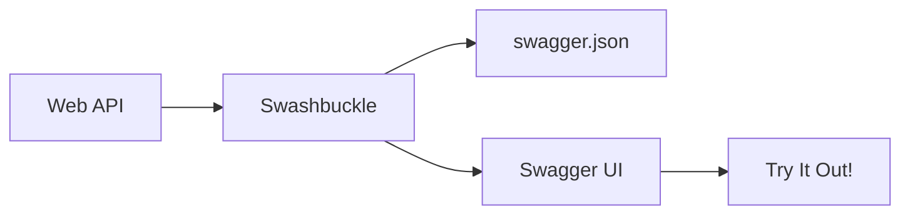

# 📚 Swagger/OpenAPI Documentation

> **Complete Guide to API Documentation with Swashbuckle**

---

## 🎯 What is Swagger/OpenAPI?

**Swagger** (OpenAPI) is a specification for describing REST APIs. **Swashbuckle** is the .NET Core implementation that auto-generates interactive API documentation.



---

## 🔧 Setting Up Swagger

### Program.cs Configuration

```csharp
// ════════════════════════════════════════════════════════════════════
// FILE: Program.cs
// PURPOSE: Configure Swagger/OpenAPI
// ════════════════════════════════════════════════════════════════════
var builder = WebApplication.CreateBuilder(args);

builder.Services.AddControllers();

builder.Services.AddEndpointsApiExplorer();
// Line 1: Enables endpoint discovery
//         - Required for Swagger to find API endpoints
//         - Works with both controllers and minimal APIs

builder.Services.AddSwaggerGen();
// Line 2: Adds Swagger generator services
//         - Generates OpenAPI specification
//         - Creates swagger.json at runtime

var app = builder.Build();

if (app.Environment.IsDevelopment())
{
    app.UseSwagger();
    // Line 3: Adds Swagger middleware
    //         - Endpoint: /swagger/v1/swagger.json
    //         - Returns OpenAPI specification
    
    app.UseSwaggerUI();
    // Line 4: Adds Swagger UI middleware
    //         - Endpoint: /swagger/index.html
    //         - Interactive API documentation
    //         - "Try it out" functionality
}

app.UseHttpsRedirection();
app.UseAuthorization();
app.MapControllers();
app.Run();
```

---

## 📝 Customizing Swagger

### API Information

```csharp
builder.Services.AddSwaggerGen(options =>
{
    options.SwaggerDoc("v1", new OpenApiInfo
    {
        Title = "My API",
        Version = "v1",
        Description = "A sample Web API",
        Contact = new OpenApiContact
        {
            Name = "Developer",
            Email = "dev@example.com",
            Url = new Uri("https://example.com")
        },
        License = new OpenApiLicense
        {
            Name = "MIT",
            Url = new Uri("https://opensource.org/licenses/MIT")
        }
    });
});
```

### JWT Authentication in Swagger

```csharp
builder.Services.AddSwaggerGen(options =>
{
    options.AddSecurityDefinition("Bearer", new OpenApiSecurityScheme
    {
        Description = "JWT Authorization header using Bearer scheme",
        Name = "Authorization",
        In = ParameterLocation.Header,
        Type = SecuritySchemeType.ApiKey,
        Scheme = "Bearer"
    });
    
    options.AddSecurityRequirement(new OpenApiSecurityRequirement
    {
        {
            new OpenApiSecurityScheme
            {
                Reference = new OpenApiReference
                {
                    Type = ReferenceType.SecurityScheme,
                    Id = "Bearer"
                }
            },
            Array.Empty<string>()
        }
    });
});
```

---

## 📊 XML Documentation

### Enable XML Comments

```xml
<!-- .csproj file -->
<PropertyGroup>
    <GenerateDocumentationFile>true</GenerateDocumentationFile>
    <NoWarn>$(NoWarn);1591</NoWarn>
</PropertyGroup>
```

### Add XML Comments to Swagger

```csharp
builder.Services.AddSwaggerGen(options =>
{
    var xmlFile = $"{Assembly.GetExecutingAssembly().GetName().Name}.xml";
    var xmlPath = Path.Combine(AppContext.BaseDirectory, xmlFile);
    options.IncludeXmlComments(xmlPath);
});
```

### Document Your API

```csharp
/// <summary>
/// Retrieves all members from the system.
/// </summary>
/// <returns>A list of all members</returns>
/// <response code="200">Returns the list of members</response>
[HttpGet]
[ProducesResponseType(StatusCodes.Status200OK)]
public IEnumerable<Members> Get()
{
    return member.GetAllMember();
}

/// <summary>
/// Creates a new member.
/// </summary>
/// <param name="member">The member to create</param>
/// <returns>The created member</returns>
/// <response code="201">Member created successfully</response>
/// <response code="400">Invalid member data</response>
[HttpPost]
[ProducesResponseType(StatusCodes.Status201Created)]
[ProducesResponseType(StatusCodes.Status400BadRequest)]
public ActionResult<Members> Post([FromBody] Members member)
{
    // ...
}
```

---

## 🔧 Swagger UI Options

```csharp
app.UseSwaggerUI(options =>
{
    options.SwaggerEndpoint("/swagger/v1/swagger.json", "My API V1");
    options.RoutePrefix = string.Empty;  // Swagger at root URL
    options.DocumentTitle = "My API Documentation";
    options.DefaultModelsExpandDepth(-1);  // Hide schemas by default
    options.DocExpansion(DocExpansion.None);  // Collapse endpoints
});
```

---

## 📋 Quick Revision Points

| Concept | Key Point |
|---------|-----------|
| **AddSwaggerGen()** | Generates OpenAPI spec |
| **UseSwagger()** | Serves swagger.json |
| **UseSwaggerUI()** | Interactive documentation |
| **XML Comments** | Enhanced descriptions |
| **[ProducesResponseType]** | Document response codes |

---

## 🎯 Key Takeaways

1. **Swagger** = Auto-generated API documentation
2. **OpenAPI** = Specification standard
3. **Development only** = Don't expose in production
4. **XML comments** = Rich documentation
5. **Try it out** = Test API directly in browser

---

*Next: [20_CORS_Configuration.md](20_CORS_Configuration.md) - Cross-Origin Resource Sharing*
