# 📚 CORS Configuration in ASP.NET Core

> **Complete Guide to Cross-Origin Resource Sharing**

---

## 🎯 What is CORS?

**CORS (Cross-Origin Resource Sharing)** is a security feature that controls which domains can access your API. By default, browsers block requests from different origins.

```mermaid
graph LR
    subgraph "Same Origin ✅"
        A1[https://myapp.com] --> API1[https://myapp.com/api]
    end
    
    subgraph "Cross Origin ❌ (Without CORS)"
        A2[https://frontend.com] -->|Blocked| API2[https://api.com]
    end
    
    subgraph "Cross Origin ✅ (With CORS)"
        A3[https://frontend.com] -->|Allowed| API3[https://api.com]
    end
```



---

## 🔧 CORS Configuration

### Method 1: Named Policy

```csharp
// ════════════════════════════════════════════════════════════════════
// FILE: Program.cs
// PURPOSE: Configure CORS with named policy
// ════════════════════════════════════════════════════════════════════
var builder = WebApplication.CreateBuilder(args);

builder.Services.AddCors(options =>
{
    options.AddPolicy("AllowFrontend", policy =>
    {
        policy.WithOrigins("https://frontend.com", "http://localhost:3000")
        // Line 1: Allowed origins
        //         - Specify exact URLs
        //         - No trailing slashes
        
              .WithMethods("GET", "POST", "PUT", "DELETE")
        // Line 2: Allowed HTTP methods
        
              .WithHeaders("Content-Type", "Authorization")
        // Line 3: Allowed headers
        
              .AllowCredentials();
        // Line 4: Allow cookies/auth headers
    });
});

var app = builder.Build();

app.UseCors("AllowFrontend");
// Line 5: Apply CORS policy globally
//         - Must be before UseAuthorization

app.UseAuthorization();
app.MapControllers();
```

### Method 2: Default Policy

```csharp
builder.Services.AddCors(options =>
{
    options.AddDefaultPolicy(policy =>
    {
        policy.AllowAnyOrigin()
              .AllowAnyMethod()
              .AllowAnyHeader();
    });
});

// Apply without policy name
app.UseCors();
```

### Method 3: Per-Controller/Action

```csharp
[EnableCors("AllowFrontend")]
[ApiController]
[Route("api/[controller]")]
public class ItemsController : ControllerBase
{
    [HttpGet]
    public IActionResult Get() => Ok();
    
    [DisableCors]  // Disable for this action
    [HttpDelete("{id}")]
    public IActionResult Delete(int id) => NoContent();
}
```

---

## 📊 CORS Flow Diagram


---

## 📋 CORS Policy Options

| Method | Description |
|--------|-------------|
| `WithOrigins()` | Specific allowed origins |
| `AllowAnyOrigin()` | Allow all origins (not with credentials) |
| `WithMethods()` | Specific HTTP methods |
| `AllowAnyMethod()` | Allow all methods |
| `WithHeaders()` | Specific request headers |
| `AllowAnyHeader()` | Allow all headers |
| `AllowCredentials()` | Allow cookies/auth |
| `WithExposedHeaders()` | Headers client can access |
| `SetPreflightMaxAge()` | Cache preflight response |

---

## ⚠️ Common Mistakes

```csharp
// ❌ WRONG - Can't use AllowAnyOrigin with AllowCredentials
policy.AllowAnyOrigin()
      .AllowCredentials();  // Throws exception!

// ✅ CORRECT - Specify origins when using credentials
policy.WithOrigins("https://frontend.com")
      .AllowCredentials();
```

---

## 📋 Quick Revision Points

| Concept | Key Point |
|---------|-----------|
| **CORS** | Browser security for cross-origin requests |
| **Origin** | Protocol + Domain + Port |
| **Preflight** | OPTIONS request before actual request |
| **UseCors()** | Before UseAuthorization |
| **Credentials** | Requires specific origins |

---

## 🎯 Key Takeaways

1. **CORS = Browser security** not API security
2. **UseCors()** before UseAuthorization()
3. **AllowCredentials** requires specific origins
4. **Preflight** = OPTIONS request for complex requests
5. **Per-action** = Use [EnableCors]/[DisableCors]

---

*Next: [21_Configuration_Secrets.md](21_Configuration_Secrets.md) - Configuration and Secrets Management*
