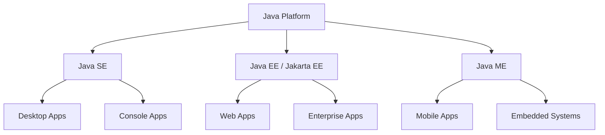
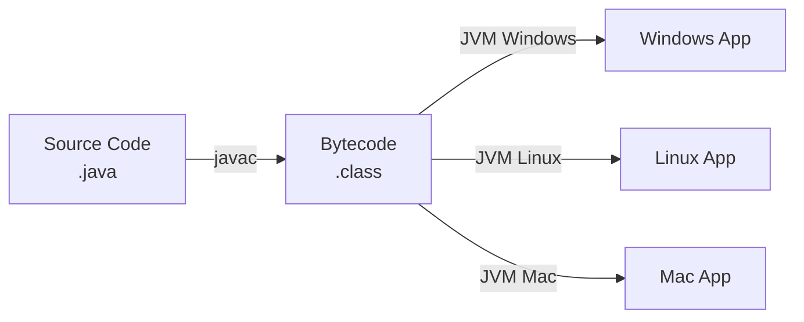
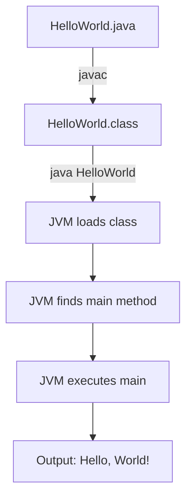

# 📚 Introduction to Java

## Table of Contents
1. [What is Java?](#what-is-java)
2. [History of Java](#history-of-java)
3. [Where Java is Used](#where-java-is-used)
4. [Java Platform Editions](#java-platform-editions)
5. [JDK vs JRE vs JVM](#jdk-vs-jre-vs-jvm)
6. [Features of Java](#features-of-java)
7. [Types of Java Applications](#types-of-java-applications)
8. [How Java is Platform Independent](#how-java-is-platform-independent)
9. [Setting Up Java Environment](#setting-up-java-environment)
10. [Your First Java Program](#your-first-java-program)
11. [Types of Comments in Java](#types-of-comments-in-java)
12. [Interview Questions](#interview-questions)

---

## What is Java?

Java is a **high-level, class-based, object-oriented programming language** designed to have as few implementation dependencies as possible. It is a general-purpose programming language intended to let programmers **"write once, run anywhere" (WORA)**.

### Key Characteristics:
- **Object-Oriented**: Everything in Java (except primitives) is an object
- **Platform Independent**: Java code runs on any device that has JVM
- **Simple & Secure**: Easy syntax, built-in security features
- **Robust**: Strong memory management, exception handling
- **Multithreaded**: Built-in support for concurrent programming

---

## History of Java

| Year | Milestone |
|------|-----------|
| 1991 | James Gosling and his team at Sun Microsystems started the "Green Project" |
| 1995 | Java 1.0 was released |
| 1996 | JDK 1.0 was released |
| 2006 | Java became open source |
| 2010 | Oracle acquired Sun Microsystems |
| 2014 | Java 8 (major release with Lambda expressions) |
| 2017 | Java 9 (Module system) |
| 2021 | Java 17 (LTS version) |

> **Note**: Java was originally called **"Oak"** (named after an oak tree outside Gosling's office), later renamed to **"Java"** (inspired by Java coffee).

---

## Where Java is Used

Java is extensively used in various domains:

```
┌─────────────────────────────────────────────────────────────────┐
│                     JAVA APPLICATIONS                            │
├─────────────────────────────────────────────────────────────────┤
│  1. Desktop Applications    - Eclipse, NetBeans, IntelliJ       │
│  2. Web Applications        - LinkedIn, Amazon, eBay            │
│  3. Mobile Applications     - Android Apps                       │
│  4. Enterprise Applications - Banking, Insurance software       │
│  5. Scientific Applications - MATLAB (partially)                │
│  6. Big Data Technologies   - Hadoop, Spark                     │
│  7. Gaming Applications     - Minecraft                         │
│  8. Embedded Systems        - Blu-ray players, Smart Cards      │
└─────────────────────────────────────────────────────────────────┘
```

---

## Java Platform Editions

Java comes in different editions for different purposes:

### 1. Java SE (Standard Edition)
- **Purpose**: Core Java for desktop and standalone applications
- **Contains**: Core libraries, JVM, basic APIs
- **Use Case**: Learning, desktop apps, console programs

### 2. Java EE (Enterprise Edition) - Now Jakarta EE
- **Purpose**: Large-scale, distributed, enterprise applications
- **Contains**: Servlets, JSP, EJB, Web Services
- **Use Case**: Web applications, microservices

### 3. Java ME (Micro Edition)
- **Purpose**: Mobile and embedded devices
- **Contains**: Lightweight APIs for resource-constrained devices
- **Use Case**: Feature phones, IoT devices



---

## JDK vs JRE vs JVM

Understanding the difference between JDK, JRE, and JVM is crucial:

### JVM (Java Virtual Machine)
- **What it is**: An abstract machine that provides runtime environment
- **Role**: Executes Java bytecode
- **Platform Specific**: Different JVM for Windows, Linux, Mac
- **Key Functions**:
  - Loads bytecode
  - Verifies bytecode
  - Executes bytecode
  - Provides runtime environment

### JRE (Java Runtime Environment)
- **What it is**: JVM + Core Libraries
- **Role**: Provides everything needed to RUN Java applications
- **Contains**:
  - JVM
  - Core classes (java.lang, java.util, etc.)
  - Supporting files

### JDK (Java Development Kit)
- **What it is**: JRE + Development Tools
- **Role**: Provides everything needed to DEVELOP Java applications
- **Contains**:
  - JRE
  - Compiler (javac)
  - Debugger (jdb)
  - Documentation generator (javadoc)
  - Archive utility (jar)

```
┌─────────────────────────────────────────────────────────────────┐
│                         JDK                                      │
│  ┌───────────────────────────────────────────────────────────┐  │
│  │                        JRE                                 │  │
│  │  ┌─────────────────────────────────────────────────────┐  │  │
│  │  │                      JVM                             │  │  │
│  │  │  • Class Loader                                      │  │  │
│  │  │  • Bytecode Verifier                                 │  │  │
│  │  │  • Execution Engine                                  │  │  │
│  │  │  • Garbage Collector                                 │  │  │
│  │  └─────────────────────────────────────────────────────┘  │  │
│  │  + Core Libraries (rt.jar)                               │  │
│  │  + Supporting Files                                       │  │
│  └───────────────────────────────────────────────────────────┘  │
│  + Development Tools (javac, jdb, javadoc, jar)                 │
└─────────────────────────────────────────────────────────────────┘
```

### Quick Comparison Table

| Component | Purpose | Who Needs It |
|-----------|---------|--------------|
| JVM | Execute bytecode | Everyone |
| JRE | Run Java programs | End users |
| JDK | Develop Java programs | Developers |

---

## Features of Java

### 1. Simple
- Syntax is based on C++ (familiar to many programmers)
- Removed complex features like pointers, operator overloading
- Automatic garbage collection

### 2. Object-Oriented
- Everything is an object (except primitives)
- Supports all OOP concepts: Encapsulation, Inheritance, Polymorphism, Abstraction

### 3. Platform Independent
- **"Write Once, Run Anywhere" (WORA)**
- Java code compiles to bytecode, which runs on any JVM
- Same `.class` file works on Windows, Linux, Mac

### 4. Secured
- No explicit pointers
- Programs run inside JVM sandbox
- Bytecode verification before execution
- Built-in security manager

### 5. Robust
- Strong memory management
- Exception handling
- Type checking at compile-time
- Automatic garbage collection

### 6. Architecture Neutral
- No implementation-dependent features
- Size of primitive types is fixed

### 7. Portable
- Bytecode can be carried to any platform
- Same behavior across platforms

### 8. High Performance
- Just-In-Time (JIT) compiler
- Bytecode is close to native code

### 9. Distributed
- Designed for distributed environments
- RMI, EJB for creating distributed applications

### 10. Multithreaded
- Built-in support for multithreading
- Can perform multiple tasks simultaneously

### 11. Dynamic
- Classes are loaded on demand
- Supports dynamic linking

---

## Types of Java Applications

### 1. Standalone/Desktop Applications
- Run independently on a computer
- Examples: Media players, Antivirus, Text editors
- Technologies: AWT, Swing, JavaFX

### 2. Web Applications
- Run on server, accessed through browser
- Examples: eBay, LinkedIn
- Technologies: Servlets, JSP, Spring MVC

### 3. Enterprise Applications
- Large-scale, distributed, multi-tiered
- Examples: Banking systems, CRM
- Technologies: EJB, Spring, Hibernate

### 4. Mobile Applications
- Run on mobile devices
- Examples: Android apps
- Technologies: Android SDK

---

## How Java is Platform Independent

### The Compilation Process



### Step-by-Step Explanation:

1. **Write Code**: You write Java source code in `.java` files
2. **Compile**: `javac` compiler converts source code to **bytecode** (`.class` files)
3. **Bytecode**: Platform-independent intermediate code
4. **JVM**: Each platform has its own JVM that converts bytecode to native machine code
5. **Execute**: JVM executes the program on the host machine

### Why is this Platform Independent?

```
┌─────────────────────────────────────────────────────────────────┐
│                     HelloWorld.java                              │
│          (Same source code for all platforms)                    │
└──────────────────────────┬──────────────────────────────────────┘
                           │ javac compiler
                           ▼
┌─────────────────────────────────────────────────────────────────┐
│                     HelloWorld.class                             │
│           (Same bytecode for all platforms)                      │
└──────────────────────────┬──────────────────────────────────────┘
                           │
        ┌──────────────────┼──────────────────┐
        ▼                  ▼                  ▼
┌───────────────┐  ┌───────────────┐  ┌───────────────┐
│  Windows JVM  │  │   Linux JVM   │  │    Mac JVM    │
└───────┬───────┘  └───────┬───────┘  └───────┬───────┘
        ▼                  ▼                  ▼
┌───────────────┐  ┌───────────────┐  ┌───────────────┐
│ Windows Native│  │ Linux Native  │  │  Mac Native   │
│     Code      │  │     Code      │  │     Code      │
└───────────────┘  └───────────────┘  └───────────────┘
```

> **Key Insight**: The bytecode is the same everywhere. Only the JVM is platform-specific!

---

## Setting Up Java Environment

### Step 1: Download JDK
1. Go to Oracle's website or OpenJDK
2. Download JDK for your operating system (32-bit or 64-bit)
3. Install JDK

### Step 2: Set Environment Variables

After installation, Java is typically installed at:
```
C:\Program Files\Java\jdk17
```

#### Setting PATH Variable (Windows):

1. **Open Environment Variables**:
   - Right-click "This PC" → Properties
   - Advanced System Settings → Environment Variables

2. **Add to PATH**:
   ```
   C:\Program Files\Java\jdk17\bin
   ```

3. **Set JAVA_HOME** (Optional but recommended):
   ```
   JAVA_HOME = C:\Program Files\Java\jdk17
   ```

### Step 3: Verify Installation

Open Command Prompt and type:
```batch
java -version
```

Expected output:
```
java version "17.0.x" 2022-xx-xx LTS
Java(TM) SE Runtime Environment (build 17.0.x+x-xx)
Java HotSpot(TM) 64-Bit Server VM (build 17.0.x+x-xx, mixed mode, sharing)
```

Also verify compiler:
```batch
javac -version
```

---

## Your First Java Program

### Sample Program with Detailed Explanation

```java
// File: HelloWorld.java

public class HelloWorld                    // Line 1
{                                          // Line 2
    public static void main(String[] args) // Line 3
    {                                      // Line 4
        System.out.println("Hello, World!"); // Line 5
    }                                      // Line 6
}                                          // Line 7
```

### Line-by-Line Explanation:

| Line | Code | Explanation |
|------|------|-------------|
| 1 | `public class HelloWorld` | Declares a public class named `HelloWorld`. Class name must match filename. |
| 2 | `{` | Opening brace of class body |
| 3 | `public static void main(String[] args)` | Main method - entry point of program |
| 4 | `{` | Opening brace of main method body |
| 5 | `System.out.println("Hello, World!");` | Prints text to console |
| 6 | `}` | Closing brace of main method |
| 7 | `}` | Closing brace of class |

### Understanding `public static void main(String[] args)`

| Keyword | Meaning |
|---------|---------|
| `public` | Accessible from anywhere (JVM needs to access it) |
| `static` | Can be called without creating an object |
| `void` | Does not return any value |
| `main` | Name of the method (recognized by JVM as entry point) |
| `String[] args` | Command-line arguments passed to program |

### Understanding `System.out.println()`

```
System.out.println("Hello, World!");
   │     │      │
   │     │      └── Method to print with newline
   │     └── Static reference to PrintStream object (standard output)
   └── Class in java.lang package (auto-imported)
```

### Compilation and Execution:

```batch
# Step 1: Compile
javac HelloWorld.java
# This creates HelloWorld.class (bytecode)

# Step 2: Run
java HelloWorld
# Output: Hello, World!
```

### Execution Flow:



---

## Types of Comments in Java

Java supports three types of comments:

### 1. Single-Line Comment
```java
// This is a single-line comment
int x = 10; // Comment can also be at end of line
```

### 2. Multi-Line Comment
```java
/* This is a
   multi-line comment
   spanning multiple lines */
int y = 20;
```

### 3. Documentation Comment (Javadoc)
```java
/**
 * This is a documentation comment.
 * Used to generate API documentation.
 * @author Your Name
 * @version 1.0
 */
public class MyClass {
    /**
     * This method adds two numbers.
     * @param a first number
     * @param b second number
     * @return sum of a and b
     */
    public int add(int a, int b) {
        return a + b;
    }
}
```

### Usage:
- **Single-line**: Quick notes, temporary code disabling
- **Multi-line**: Longer explanations, code blocks
- **Javadoc**: API documentation (generates HTML docs using `javadoc` command)

---

## Interview Questions

### Q1: What is Java?
**Answer**: Java is a high-level, class-based, object-oriented programming language designed to be platform-independent. It follows the "Write Once, Run Anywhere" principle.

### Q2: What is the difference between JDK, JRE, and JVM?
**Answer**:
- **JVM**: Abstract machine that executes bytecode
- **JRE**: JVM + Core libraries (needed to run Java programs)
- **JDK**: JRE + Development tools (needed to develop Java programs)

### Q3: Why is Java platform independent?
**Answer**: Java source code compiles to bytecode which is platform-independent. This bytecode runs on JVM, which is platform-specific. The same bytecode can run on any platform that has a compatible JVM.

### Q4: What is bytecode?
**Answer**: Bytecode is an intermediate code generated after compiling Java source code. It has `.class` extension and is not readable by humans. It's executed by JVM.

### Q5: Why is main method static in Java?
**Answer**: The main method is static because JVM needs to call it without creating an object of the class. If it wasn't static, JVM would need to create an object first, but it doesn't know how (what constructor to call, what parameters to pass).

### Q6: What is the role of String[] args in main method?
**Answer**: `String[] args` is used to receive command-line arguments. When you run `java MyClass arg1 arg2`, the values "arg1" and "arg2" are stored in this array.

### Q7: What are the features of Java?
**Answer**: Simple, Object-Oriented, Platform Independent, Secure, Robust, Architecture Neutral, Portable, High Performance, Distributed, Multithreaded, Dynamic.

### Q8: What is WORA?
**Answer**: WORA stands for "Write Once, Run Anywhere". It means Java code written once can run on any platform that has JVM installed.

### Q9: Can we run Java without installing JDK?
**Answer**: Yes, we can run Java programs with just JRE installed. JDK is needed only for development (compilation). End users need only JRE.

### Q10: What happens when we compile a Java program?
**Answer**: The `javac` compiler:
1. Checks for syntax errors
2. Converts source code to bytecode
3. Creates `.class` file with the same name as the class

---

## Quick Reference

### Common Commands

| Command | Purpose |
|---------|---------|
| `javac FileName.java` | Compile Java source file |
| `java ClassName` | Run compiled Java program |
| `javac -version` | Check compiler version |
| `java -version` | Check JRE version |
| `javadoc FileName.java` | Generate API documentation |

### Directory Structure

```
C:\Program Files\Java\jdk17\
├── bin\           # Executables (javac, java, jar)
├── lib\           # Libraries
├── include\       # Header files for native code
├── jmods\         # Java modules
└── conf\          # Configuration files
```

---

## Summary

| Concept | Key Point |
|---------|-----------|
| Java | High-level, OOP, platform-independent language |
| JVM | Executes bytecode, platform-specific |
| JRE | JVM + Libraries, for running programs |
| JDK | JRE + Tools, for developing programs |
| Bytecode | Platform-independent intermediate code (.class) |
| Platform Independence | Same bytecode runs on any JVM |
| main() | Entry point of Java program |
| Comments | //, /* */, /** **/ |

---

*Next: [02_Data_Types_and_Variables.md](./02_Data_Types_and_Variables.md)*
